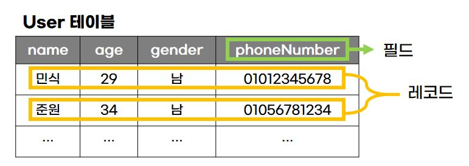
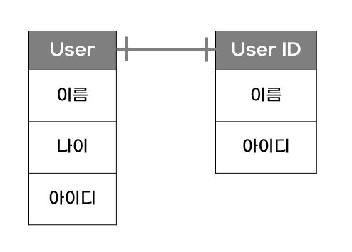

# Database와 DBMS
## Database (DB, DataBase)
- 일정한 규칙을 통해 구조화되어 저장되는 **데이터의 모음, 모음집**
- 실시간 접근, 동시 공유가 가능함

### 데이터베이스의 종류
1. 관계형 데이터베이스
   - MySQL, Oracle ...
2. NoSQL 데이터베이스
   - MongoDB ...

## DBMS (DataBase Management System)
- **데이터베이스를 제어, 관리, 통합하는 시스템**
- DB안에 있는 데이터들은 특정 DBMS마다 정의된 쿼리 언어를 통해 CRUD 등을 수행할 수 있음

> ✅ CRUD: Create(생성), Read(읽기), Update(수정), Delete(삭제)


- DB 위에 DBMS, DBMS위에 응용 프로그램이 있으며, 이러한 구조를 기반으로 데이터를 주고받음

# 용어
## 1. 엔티티 (Entity)
- 사람, 장소, 물건, 사건, 개념 등 여러 개의 속성을 지닌 명사
  - ex) '사용자'라는 Entity가 있으면 이름, 나이, 아이디, 전화번호, 이메일 등은 속성이 됨
### 약한 엔티티와 강한 엔티티
- A가 혼자서는 존재하지 못하고, B의 존재 여부에 종속적일때 A는 **약한 엔티티**, B는 **강한 엔티티**
  - ex) 교실은 학교안에만 존재하기 때문에 교실이 약한 엔티티가 되고, 학교가 강한 엔티티가 됨

## 2. 릴레이션 (Relation) (=테이블, 컬렉션)
- 데이터베이스에서 **정보를 구분하여 저장하는 기본 단위**
  - 관계형 데이터베이스에서는 `테이블`이라 함
  - NoSQL데이터베이스에서는 `컬렉션`이라 함
- 데이터베이스는 엔티티에 관한 데이터를 하나의 릴레이션에 담아 관리함

### 테이블과 컬렉션 ?
- 관계형 데이터베이스(MySQL)의 구조
  - 레코드 & 테이블 & 데이터베이스
  - 레코드가 쌓여 테이블이 되고, 쌓인 테이블이 데이터베이스가 됨 
- NoSQL의 구조
  - 도큐먼트 & 컬렉션 & 데이터베이스


## 3. 속성 (Attribute)
- 릴레이션에서 관리하는 구체적이고 **고유한 이름을 갖는 정보**
- 서비스 요구 사항을 기반으로 관리해야할 필요가 있는 속성들

## 4. 도메인 (Domain)
- 릴레이션에 포함된 **각각의 속성들이 가질 수 있는 값의 집합**
- '동의여부'이라는 속성이 있으면, 이 속성이 가질 수 있는 값은 {동의, 비동의}
- '성별'이란 속성이 있으면, {여자, 남자}


## 5. 필드와 레코드 


- '사용자' 엔티티 =  'user' 테이블
- 속성(이름, 나이, 성별, 전화번호) = 필드(name, age, gender, phoneNumber)
- 테이블에 쌓이는 행(row) 단위의 데이터를 `레코드` or `튜플`이라고 함

### 속성에 맞는 타입 정의하기
- 엔티티를 DB에 넣어 테이블로 만드려면 **속성에 맞는 타입을 정의해주어야 함**
```sql
- name(이름): VARCHAR(25)
- age(나이): INT
- gender(성별): VARCHAR(25)
- phonenumber(전화번호): VARCHAR(30)
- birthday(생년월일): DATETIME
```
### 테이블 만들기
```sql
CREATE TABLE user(
    id INT NOT NULL AUTO_INCREMENT,
    name VARCHAR(25),
    age INT,
    phonenumber VARCHAR(25),
    birthday DATETIME,
    PRIMARY KEY(id)
);
```
### 필드 타입
- 필드는 타입을 가짐 (단, DBMS마다 다름)
1. 숫자
    |타입|용량(바이트)|
    |:-:|:--:|
    |TINYINT|1|
    |SMALLINT|2|
    |MEDIUMINT|3|
    |INT|4|
    |BIGINT|8|

2. 날짜
    |타입|용량(바이트)|설명|
    |:-:|:-:|:--|
    |DATE|3|날짜만 표기하는 경우, `yyyy-mm-dd` 형식
    |DATETIME|8|날짜와 시간 모두 표기하는 경우, `yyyy-mm-dd hh:mm:ss` 형식}
    |TIMESTAMP|4|DATETIME과 같지만 지원 범위가 1970부터임

3. 문자
    |타입|설명|
    |:-:|:--|
    |CHAR|테이블 생성 시 선언한 길이로 `고정`되며 0~255사이의 값을 가짐. CHAR(30)이라면 최대 30글자까지 입력 가능|
    |VARCHAR|가변길이 문자열로, 길이는 0~65535사이의 값으로 지정 가능하고 입력된 데이터에 따라 용량을 가변시켜 저장함. VARCHAR(1000)이라 선언해도 10글자만 입력하면 10글자에 해당하는 바이트 + 길이 기록용 1바이트로 저장|
    |TEXT|큰 데이터 저장 시 주로 사용함 ex) 게시판 본문|
    |BLOB|이미지, 동영상 등 큰 데이터 저장에 쓰이나 보통 이미지 호스팅 서비스를 이용해 서버에 파일을 올리고 파일에 관한 경로를 VARCHAR로 저장|
    |ENUM|문자열을 열거한 타입. ENUM리스트에 없는 잘못된 값을 삽입하면 빈 문자열이 대신 삽입됨. 최대 65535개의 요소들을 넣을 수 있음|
    |SET|ENUM과 비슷하나 여러 개의 데이터를 선택할 수 있고 비트 단위의 연산이 가능함. 최대 64개의 요소를 넣을 수 있음|

## 6. 관계
- 데이터베이스에는 여러 개의 테이블이 있고, 이 테이블들은 서로 관계가 정의되어 있음
- 관계는 관계 화살표로 표현함

    

### 1) 1:1 관계
- 테이블을 두 개의 테이블로 나눠 테이블의 구조를 더 이해하기 쉽게 만들어줌
- ex) 사용자당 아이디는 한 개씩있음

    

### 2) 1:N 관계
- 한 개체가 다른 많은 개체를 포함하는 관계
- ex) 사용자는 여러 개의 상품을 구매할 수 있음
- ex) 하나도 구매하지 않는 경우가 있을 수 있으니 0도 포함하는 화살표로 그려야함

    

### 3) N:M 관계
- 테이블 두 개를 직접 연결해서 구축하지 않고 1:N, 1:M 관계를 갖는 테이블 두 개로 나눠서 설정함
- ex) 학생은 여러 개의 강의를 들을 수 있고, 강의도 여러 명의 학생을 포함할 수 있음

    

## 7. 키
- 테이블 간의 관계를 더 명확하게 하고, 테이블 자체의 인덱스를 위해 설정된 장치

    

### 1) 기본키 (Primary key, PK)
- 유일성과 최소성을 만족하는 키
- 테이블의 데이터 중 고유하게 존재하는 속성 => `중복되어서는 안됨`
- 기본키는 자연키와 인조키 중 골라쓰면 됨

#### 1-1) 자연키
- 중복된 값들을 제외하며 중복되지 않는 것을 '자연스레'뽑다가 나오는 키
- 언젠가는 변하는 속성을 가짐
- ex) 주민등록번호 ...

#### 1-2) 인조키
- **인위적으로 생성한 키**
- 자연키와 대조적이며 변하지 않음
- 보통 기본키는 인조키로 설정함
- ex) 인위적으로 부여한 유저아이디

### 2) 외래키 (Foreign key, FK)
- 다른 테이블의 기본키를 그대로 참조하는 값
- 개체와의 관계 식별 시 사용함
- 외래키는 중복되어도 상관 X

### 3) 후보키 (Candidate key)
- 기본키가 될 수 있는 후보들로, 유일성과 최소성 둘다 만족하는 키

### 4) 대체키 (Alternate key)
- 후보키가 두 개 이상일 경우, 하나를 기본키로 지정하고 남은 후보키들

### 5) 슈퍼키 (Super key)
- 각 레코드를 유일하게 식별할 수 있는 키
- 유일성을 만족함