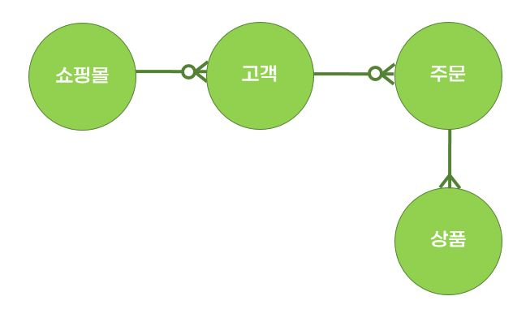

# ERD (Entity Relationship Diagram)
- 릴레이션 간의 관계들을 정의한 것
- 데이터베이스를 구축할 때 가장 기초적인 뼈대 역할을 함

## ERD는 필수인가?
- ERD는 시스템의 요구사항을 기반으로 작성되며 이를 기반으로 데이터베이스를 구축함
- 관계형 구조를 표현할 수 있는 데이터를 구성하는데에는 유용한 설계도가 되어줄 수 있지만, 비정형 데이터는 충분히 표현할 수 없음

> ✅ 비정형 데이터 (=비구조화 데이터)
: 미리 정의된 데이터 모델이 없거나 미리 정의된 방식으로 정리되지 않은 데이터

## ERD 그리기
- 요구사항
  - 쇼핑몰은 0~n명의 고객을 관리함
  - 고객은 0~n개의 주문을 넣을 수 있음
  - 주문에는 1~n개의 상품이 들어감

    