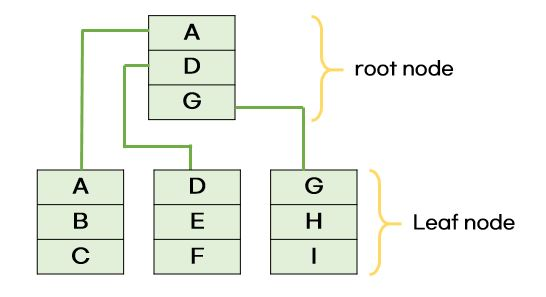

# index (인덱스)

- 데이터를 빠르게 찾을 수 있는 장치
- 인덱스는 **B-Tree**라는 자료구조로 이루어짐

## 인덱스가 필요한 이유?

- 인덱스를 설정하면 테이블 안에 찾고자 하는 데이터를 빠르게 찾을 수 있기 때문

- H를 찾는다고 하면 H가 있을 법한 leaf node를 탐색하면 쉽게 찾을 수 있음
- 이러한 자료 구조 없이 E를 탐색하려면 A,B,C,D,E,F,G,H 이렇게 모두 탐색해야하지만, 노드를 나누면 탐색횟수를 확 줄일 수 있음

## B-Tree

- 탐색 성능을 높이기 위해 균형있게 높이를 유지하는 **Balanced tree**
- 모든 Leaf node가 같은 레벨로 유지되도록 자동으로 밸런스를 맞춰줌
- node의 자식 수 중 최댓값을 k라하면, 해당 B-tree를 `k차 B-Tree`라 함

### B-Tree 조건 

1. node의 key는 반드시 정렬된 상태여야 함
2. node의 key 개수가 k개이면, 자식 node의 수는 k+1개
3. 자식 node들의 key는 현재 node의 key를 기준으로 크기 순으로 나뉨
4. root node는 항상 2개 이상의 자식 node를 가짐 (root node가 leaf node인 경우는 제외)
5. 모든 leaf node들은 같은 level에 있어야 함

### B-Tree를 사용하는 이유

- 일반적인 트리는 탐색하는데 평균 시간 복잡도가 O(logN)을 갖지만, 트리가 편향된 경우 최악의 시간복잡도가 O(N)이 됨
- 따라서 트리가 편향되지 않도록 항상 밸런스를 유지하는 트리가 필요하며, 밸런스가 유지되는 트리는 최악의 경우에도 O(logN)의 시간이 보장됨

cf. [B-Tree](https://rebro.kr/169)

## 인덱스가 효율적인 이유

- 효율적인 단계를 거쳐 모든 요소에 접근할 수 있는 균형잡힌 트리 구조와 트리 깊이의 대수확장성 때문

### 대수확장성

- 트리 깊이가 leaf node의 수에 비해 매우 느리게 성장하는 것
- 기본적으로 인덱스가 한 깊이(level)씩 증가할 때마다 최대 인덱스 항목의 수는 4배씩 증가함

# index 만드는 방법 (with MySQL)

- index는 데이터베이스마다 만드는 방법이 다름
- MySQL에는 클러스터형 인덱스, 세컨더리 인덱스가 있음
- 하나의 인덱스만 생성할거면 클러스터형 인덱스를 만드는 게 성능이 더 좋음

## 클러스터형 인덱스 만들기

- 클러스터형 인덱스는 테이블당 하나씩 설정 가능함
- primary key 옵션으로 기본키를 만들면 클러스터형 인덱스를 생성할 수 있음
- 기본키로 만들지 않고 `unique not null` 옵션을 붙이면 클러스터형 인덱스로 만들 수 있음

## 세컨더리 인덱스 만들기

- `create index ..` 명령어를 기반으로 만들면 됨
- 세컨더리 인덱스는 보조 인덱스로 여러 개의 필드 값을 기반으로 쿼리를 많이 보낼때 생성해야 하는 인덱스
- ex) age 필드로만 쿼리를 보내려면 클러스터형을 써야하고, age, name, email 필드를 기반으로 쿼리를 보내려면 세컨더리를 이용해야함

# index 최적화 기법

1. 인덱스는 조회, 추가, 수정, 삭제될때마다 비용이 듦
   - 그러므로 인덱스를 무작정 다 설정하는 것은 답이 아님
2. 서비스 특징에 따라 다르므로 항상 테스팅을 해보아야 함
3. 복합 인덱스를 생성할 땐 순서를 잘 고려해야함
   - 인덱스 생성 순서에 따라 성능이 달라짐
   - 같음, 정렬, 다중 값, 카디널리티 순서로 생성해야 함
