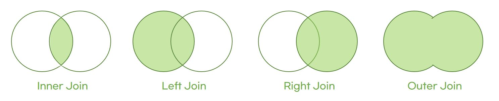

# Join
- 두 개 이상의 테이블을 묶어 하나의 결과물을 만드는 것
- MySQL에서는 `Join`, MongoDB에서는 `lookup` 쿼리로 Join을 구현
- MongoDB의 Join 연산은 관계형 데이터베이스보다 성능이 떨어져 되도록 사용하지 않는 게 좋음
  - 따라서 Join 작업이 많을 경우 관계형 데이터베이스를 쓰는 게 좋음!

# Join의 종류


## 1. inner join (내부 조인)
- 두 테이블 간의 **교집합**을 나타냄
- 왼쪽, 오른쪽 테이블에 서로 일치하는 행이 있는 부분만 표기
```sql
SELECT *
FROM TABLE_A
INNER JOIN TABLE_B
ON TABLE_A.key = TABLE_B.key
```


## 2. left outer join (왼쪽 조인)
- 왼쪽 테이블의 모든 행이 결과 테이블에 표기됨
```sql
SELECT *
FROM TABLE_A
LEFT JOIN TABLE_B
ON TABLE_A.key = TABLE_B.key
```

## 3. right outer join (오른쪽 조인)
- 오른쪽 테이블의 모든 행이 테이블에 표기됨
```sql
SELECT *
FROM TABLE_A
RIGHT JOIN TABLE_B
ON TABLE_A.key = TABLE_B.key
```

## 4. full outer join (합집합 조인)
- 두 테이블의 모든 레코드 집합을 생성함
- 두 개의 테이블 내의 서로 일치하지 않는 조건까지도 모두 표기
- 일치하는 항목이 없으면 빈 값에 `null`을 표기함
```sql
SELECT *
FROM TABLE_A
FULL OUTER JOIN TABLE_B
ON TABLE_A.key = TABLE_B.key
```

# Join의 원리
## 1. 중첩 루프 조인 (NLJ, Nested Loop Join)
- 중첩 for문과 같은 원리로, 조건에 맞는 조인을 하는 방법
- 랜덤 접근에 대한 비용이 많이 증가하므로 대용량의 테이블에서는 사용하지 않음

ex) t1, t2 테이블을 조인하는 경우

-> t1 테이블에서 행을 한 번에 하나씩 읽고, t2 테이블에서도 행을 한 번에 하나씩 읽어 조건에 맞는 레코드를 찾아 결과 값을 반환함

### + 블록 중첩 루프 조인 (BNL, Block Nested Loop)
- 조인할 테이블을 작은 블록으로 나눠서 블록 하나씩 조인하는 방법

## 2. 정렬 병합 조인
- 각각의 테이블을 조인할 필드 기준으로 정렬한 후 조인 작업을 수행하는 방법
- 조인할 때 쓸 적절한 인덱스가 없을 때
- 대용량 테이블들을 조인하고 조인 조건으로 범위 비교 연산자가 있을 때 사용

## 3. 해시 조인
- 해시 테이블을 기반으로 조인하는 방법
- 보통 한 테이블이 메모리에 잘 들어가면 중첩 루프조인보다 더 효율적이라고 함. 
- 동등(=) 조인에서만 사용 가능

### 해시 조인의 과정 
ex) artists와 songs 테이블을 조인하는 경우 
1. 빌드 단계
- 입력 테이블 중 하나를 기반으로 메모리 내 해시 테이블을 빌드하는 단계
- 둘 중 바이트가 더 작은 테이블을 기반으로 해서 테이블을 빌드

2. 프로브 단계
- 프로브 단계 동안 레코드를 읽기 시작하며, 각 레코드에서 'artists.id`에 일치하는 레코드를 찾아 결과값으로 반환