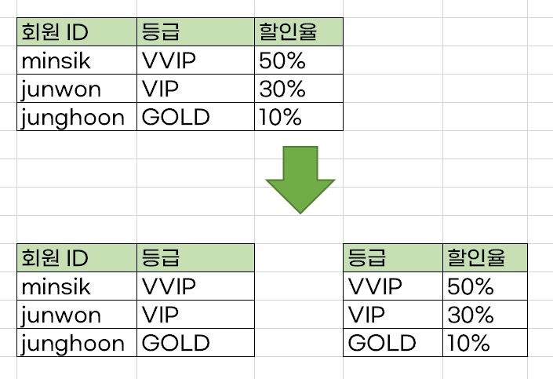

# 정규화 (Normalization)
- 릴레이션을 여러 개로 분리하는 과정
- 테이블을 무손실 (원래대로 복원 가능한) 분해를 하는 과정
- 
## 정규화를 하는 이유?
- 중복을 최대한 제거해 데이터베이스 이상현상 발생 가능성을 줄이기 위함 
- 저장 공간을 효율적으로 사용하기 위함

## 데이터베이스 이상현상 (Anomaly)
- 테이블에서 데이터 중복으로 인해 문제가 발생하는 현상

### 1) 삽입 이상
- 테이블에 데이터를 삽입할 때, 원하지 않는 값들로 인해 삽입할 수 없는 현상

### 2) 삭제 이상
- 테이블에서 한 튜플을 삭제할 때, 연쇄삭제가 발생하는 현상

### 3) 갱신 이상
- 튜플에 있는 속성 값을 갱신할 때, 일부 튜플의 정보만 갱신되어 문제가 발생하는 현상 

# 정규화의 원칙과 과정
- 정규화된 정도는 정규형(NF, Normal Form)으로 표현함
- 기본 정규형
  - 제 1정규형
  - 제 2정규형
  - 제 3정규형
  - 보이스/코드 정규형
- 고급 정규형
  - 제 4정규형
  - 제 5정규형

## 정규형 원칙
- 좀 더 좋은 구조로 만들 것
- 자료의 중복을 최소화할 것
- 독립적인 관계는 별개의 릴레이션으로 표현해야 하고, 각각의 릴레이션은 독립적인 표현이 가능해야 함

## 정규형 과정
### 1. 제 1 정규형
- 릴레이션의 모든 도메인은 더이상 분해될 수 없는 `원자값`(atomic value)만으로 구성되어야 함
- 한 개의 기본키에 대해 두 개 이상의 값을 가지는 반복 집합이 있는 경우 제거해야 함

    
- 반복 집합을 제거함

### 2. 제 2정규형
- 릴레이션이 제 1정규형이면서 부분 함수의 종속성을 제거한 형태를 의미함
> ✅ `부분 함수의 종속성 제거`란 기본키가 아닌 모든 속성이 기본키에 완전 함수 종속적인 것을 의미함 

- `기본키인 {id, user_id}}와 완전 종속된 id 릴레이션`과 `{user_id, course_list, achievement} 릴레이션`으로 분리됨

📌 단 릴레이션 분해시 동등한 릴레이션으로 분해되어야 하며, 정보 손실이 발생하지 않는 `무손실 분해`로 분해되어야 함

### 3. 제 3정규형
- 제 2정규형이며 기본키가 아닌 모든 속성이 이행적 함수 종속을 만족하지 않는 상태

> ✅ `이행적 함수 종속`이란 A➡B와 B➡가 존재하면 논리적으로 A➡C가 성립하는데, 이때 집합 C가 집합 A에 이행적으로 함수 종속이 되었다고 말함

- 회원 ID와 등급, 할인율이 정해진 테이블을 분해하는 것

### 4. 보이스/코드 정규형 (BCNF)
- 릴레이션이 제 3규형이며 결정자가 후보키가 아닌 함수 종속관계를 제거하여, 릴레이션의 함수 종속 관계에서 모든 결정자가 후보키인 상태

> ✅ `결정자`란 함수 종속 관계에서 특정 종속자(dependent)를 결정짓는 요소. 'X➡Y'일때 X는 결정자고 Y는 종속자.

- 요구사항
  - 각 수강과목에 대해 한 학생은 오직 한 강사의 강의만 수강함
  - 각 강사는 한 수강과목만 담당함
  - 한 수강과목은 여러 강사가 담당할 수 있음
  

- 위의 릴레이션에서 {회원고유번호, 수강과목} or {회원고유번호, 강사}가 후보키가 됨
- E가 'JAVA'강의를 담당한다 했을 때 이를 삽입하면 {회원고유번호}가 NULL이 됨
- {강사}가 결정자이지만 후보키가 아니므로 {강사}를 분리해야 함

# 정규화는 항상 성능을 좋게 만드는가?
- 정규형 과정을 거친다고 해서 성능이 100% 좋아지는 것은 아님
- 성능이 더 좋아질 수도, 나빠질 수도 있음
- 테이블을 나누게 되면 조인을 많이 해야해서 오히려 성능이 나빠질 수도 있음
- 서비스에 따라 정규화나 비정규화를 거쳐야 함