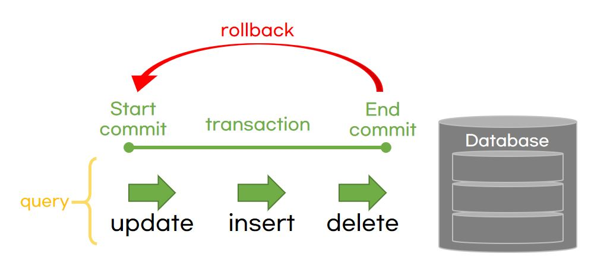

# 트랜잭션 (Transaction)

- 데이터베이스의 상태를 변화를 이용해 시키기 위해 수행하는 작업의 단위
- 상태를 변화시킨다는 것
  - SQL 질의어로 DB에 접근하는 것

## Commit

- 여러 쿼리가 성공적으로 처리되었다고 확정하는 명령어
- 트랜잭션 단위로 수행되며, 변경된 내용은 모두 영구적으로 저장되는 것
- `커밋이 수행되었다.` === `하나의 트랜잭션이 성공적으로 수행되었다.`

## Rollback

- 트랜잭션으로 처리한 하나의 묶음 과정을 일어나기 전으로 돌리는(취소하는) 것

- 쿼리(update, insert, delete 등)가 하나의 트랜잭션 단위로 수행되어 DB에 영구저장됨
- 에러나 여러 이슈로 인해 트랜잭션 전으로 돌려야할 때 `rollback`을 이용함

# 트랜잭션의 특징 (4가지 - ACID)

## 1. 원자성 (Atomicity) - `all or nothing`

- 트랜잭션이 DB에 모두 반영되거나, 혹은 전혀 반영되지 않아야 한다.
- 데이터베이스 사용자는 연산의 과정을 볼 수 없고 오직 연산 후의 상황만 볼 수 있음

## 2. 일관성 (Consistency)

- 트랜잭션의 작업 처리 결과는 항상 일관성 있어야 한다.
- `허용된 방식`으로만 데이터를 변경해야 하는 것

## 3. 독립성, 격리성 (Isolation)

- 둘 이상의 트랜잭션이 동시에 병행 실행되고 있을때, 다른 트랜잭션 연산에 끼어들 수 없다.
- 트랜잭션 수행 시 서로 끼어들지 못하는 것
- 격리성은 여러 개의 격리 수준으로 나뉘어 격리성을 보장함
  - `SERIALIZABLE` > `REPEATABLE_READ` > `READ_COMMITTED` > `READ_UNCOMMITTED`
  - 오른쪽으로 갈수록 격리성은 약해지고, 동시성은 강해짐

## 4. 지속성 (Durability)

- 트랜잭션이 성공적으로 완료되었으면, 결과는 영구적으로 반영되어야 한다.
- 데이터베이스에 시스템 장애가 발생해도 원래 상태로 복구하는 회복 기능이 있어야함을 의미
- 데이터베이스는 이를 위해 checksum, 저널링, rollback 등의 기능을 제공함

> ✅ checksum: 중복 검사의 한 형태. 오류 정정을 통해 송신된 자료의 무결성을 보호하는 방법

> ✅ 저널링: 파일 시스템, 데이터베이스 시스템의 변경사항에 대한 로그를 남기는 것

# 무결성

- 데이터의 정확성, 일관성, 유효성을 유지하는 것
- 무결성이 유지되어야 데이터베이스에 저장된 데이터 값과 현실 세계의 실제 값이 일치하는지에 대한 신뢰가 생김

|     | 무결성      |                                                                                                  |
| :-: | :---------- | :----------------------------------------------------------------------------------------------- |
|  1  | 개체 무결성 | 기본키로 선택된 필드는 NULL값을 허용하지 않음                                                    |
|  2  | 참조 무결성 | 서로 참조 관계에 있는 두 테이블의 데이터는 항상 일관된 값을 유지해야함                           |
|  3  | 고유 무결성 | 특정 속성에 대해 고유한 값을 가지도록 조건이 주어진 경우, 그 속성 값은 모두 고유한 값을 가짐     |
|  4  | NULL 무결성 | 특정 속성값에 NULL이 올 수 없다는 조건이 주어진 경우, 그 속성 값은 NULL이 될 수 없다는 제약 조건 |
