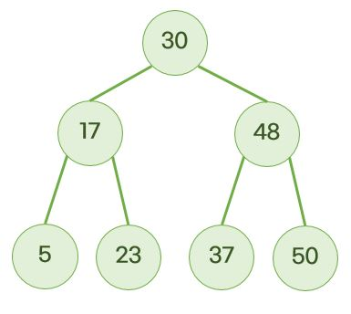

# Tree

- 그래프의 특수한 형태로, 계층 구조이다.
- 사이클이 없다.
- N개의 정점과 N-1개의 간선으로 이루어져 있다.
- 큰 데이터를 처리하는 소프트웨어(Database system or file system)는 대부분 트리 자료구조로 저장해서 이진탐색 등으로 빠른 탐색을 한다.

|           | 부모 노드 수 | 자식 노드 수 |
| :-------: | :----------: | :----------: |
| 루트 노드 |     0개      |   0개 이상   |
| 자식 노드 |     1개      |   0개 이상   |

## Binary Tree (=Binary Search Tree; BST)

- 이진 트리는 자식 노드의 개수가 0~2개이다.
- 부모 노드 기준으로 왼쪽 노드 값은 작아야하고, 오른쪽 노드 값은 커야한다.
  - `왼쪽 자식 노드` < `부모 노드` < `오른쪽 자식 노드`



### 트리의 3가지 탐색 방법

부모를 언제 탐색하느냐에 따라 다르다.

1. 전위 순회 (Preorder)

   - `부모` -> `왼쪽` -> `오른쪽`
   - 30, 17, 5, 23, 48, 37, 50

   ```js
   function PreOrder(node) {
     visit(node);
     PreOrder(node.left);
     PreOrder(node.right);
   }
   ```

2. 중위 순회 (Inorder)

   - `왼쪽` -> `부모` -> `오른쪽`
   - 5, 17, 23, 30, 37, 48, 50

   ```js
   function InOrder(node) {
     PreOrder(node.left);
     visit(node);
     PreOrder(node.right);
   }
   ```

3. 후위 순회 (Postorder)

   - `왼쪽` -> `오른쪽` -> `부모`
   - 5, 23, 17, 37, 50, 48, 30

   ```js
   function PostOrder(node) {
     PreOrder(node.left);
     PreOrder(node.right);
     visit(node);
   }
   ```

## 🌈 직접 구현해보는 Binary Search Tree (BST)

- remove() 구현 진짜 너무 어렵다

```js
class Node {
  constructor(value) {
    this.value = value; // Root node
    this.left = null; // left leaf node
    this.right = null; // right leaf node
  }
}

class BST {
  constructor() {
    this.root = null;
  }

  insert(value) {
    const newNode = new Node(value);
    if (this.root === null) {
      // 아직 트리가 없음
      this.root = newNode;
    } else {
      // 이미 트리가 있음
      let subRootNode = this.root;
      while (true) {
        if (value < subRootNode.value) {
          // left
          if (!subRootNode.left) {
            // 왼쪽 자식이 비어있으면
            subRootNode.left = newNode; // 그냥 왼쪽에 붙이면 된다.
            return;
          }
          // 왼쪽 자식이 비어있지 않다면
          subRootNode = subRootNode.left; // 왼쪽 자식을 subRootNode 자리로 올린다.
        } else {
          // right
          if (!subRootNode.right) {
            subRootNode.right = newNode;
            return;
          }
          subRootNode = subRootNode.right; // 오른쪽 자식을 subRootNode 자리로 올린다.
        }
      }
    }
  }

  // 트리에 해당 값이 있는지를 확인
  lookup(value) {
    let subRootNode = this.root; // 현재 루트 값을 넣어주고
    while (subRootNode != null) {
      if (value < subRootNode.value) {
        // left
        subRootNode = subRootNode.left;
      } else if (value > subRootNode.value) {
        // right
        subRootNode = subRootNode.right;
      } else if (value === subRootNode.value) {
        return true;
      }
    }
    return false;
  }

  remove(value) {
    if (!this.root) {
      return false;
    }
    let subRootNode = this.root;
    let parentNode = null;
    while (subRootNode) {
      if (value < subRootNode.value) {
        parentNode = subRootNode;
        subRootNode = subRootNode.left;
      } else if (value > subRootNode.value) {
        parentNode = subRootNode;
        subRootNode = subRootNode.right;
      } else if (subRootNode.value === value) {
        //We have a match, get to work!

        //Option 1: No right child:
        if (subRootNode.right === null) {
          if (parentNode === null) {
            this.root = subRootNode.left;
          } else {
            //if parent > current value, make current left child a child of parent
            if (subRootNode.value < parentNode.value) {
              parentNode.left = subRootNode.left;

              //if parent < current value, make left child a right child of parent
            } else if (subRootNode.value > parentNode.value) {
              parentNode.right = subRootNode.left;
            }
          }

          //Option 2: Right child which doesnt have a left child
        } else if (subRootNode.right.left === null) {
          subRootNode.right.left = subRootNode.left;
          if (parentNode === null) {
            this.root = subRootNode.right;
          } else {
            //if parent > current, make right child of the left the parent
            if (subRootNode.value < parentNode.value) {
              parentNode.left = subRootNode.right;

              //if parent < current, make right child a right child of the parent
            } else if (subRootNode.value > parentNode.value) {
              parentNode.right = subRootNode.right;
            }
          }

          //Option 3: Right child that has a left child
        } else {
          //find the Right child's left most child
          let leftmost = subRootNode.right.left;
          let leftmostParent = subRootNode.right;
          while (leftmost.left !== null) {
            leftmostParent = leftmost;
            leftmost = leftmost.left;
          }

          //Parent's left subtree is now leftmost's right subtree
          leftmostParent.left = leftmost.right;
          leftmost.left = subRootNode.left;
          leftmost.right = subRootNode.right;

          if (parentNode === null) {
            this.root = leftmost;
          } else {
            if (subRootNode.value < parentNode.value) {
              parentNode.left = leftmost;
            } else if (subRootNode.value > parentNode.value) {
              parentNode.right = leftmost;
            }
          }
        }
        return true;
      }
    }
  }
}

const tree = new BST();
// console.log(tree);
tree.insert(9);

tree.insert(4);
tree.insert(6);
tree.insert(20);
// tree.insert(170);
tree.insert(15);
// console.log(tree);
// console.log(tree);
// console.log(tree.lookup(6));
tree.remove(9);
console.log(tree);
```
