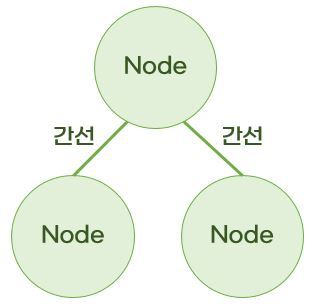
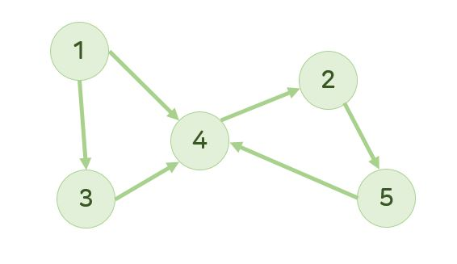
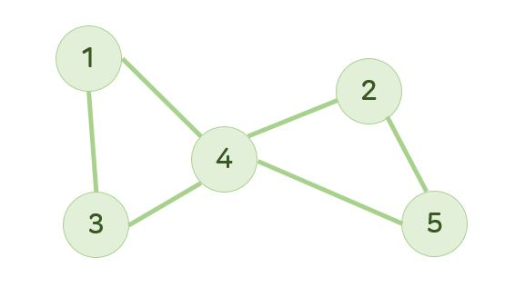
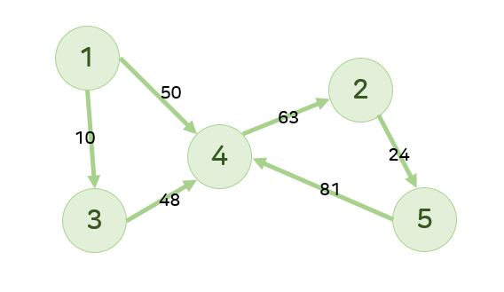
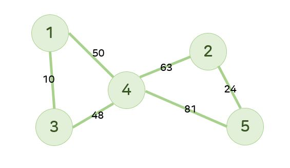
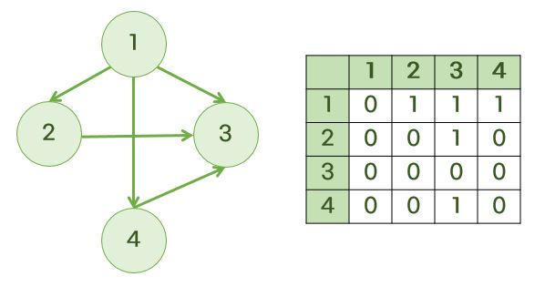
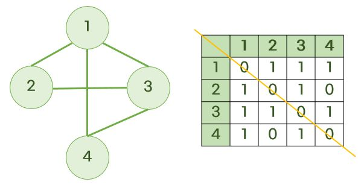
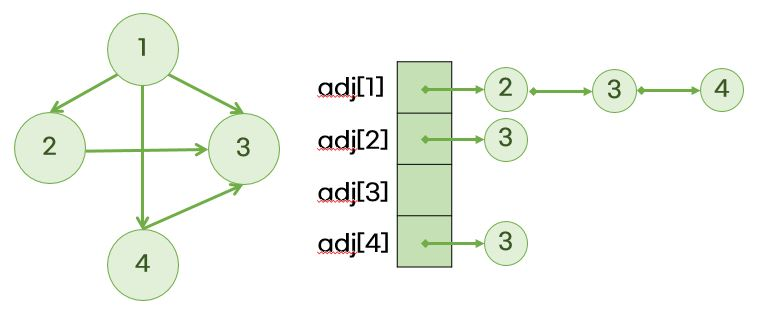
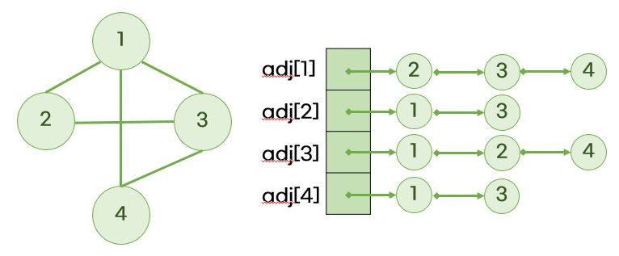

# 그래프 (Graph)



- 정점(Node, vertext)과 간선(Edge)으로 이루어진 자료구조
  - 정점(Vertex, Node): 데이터가 담기는 지점
  - 간선(Edge): 노드와의 관계를 표현
  - 차수(Degree): 하나의 정점에 인접한 정점의 수
- root node가 없는 트리처럼 보임

|         종류          | 설명                                                                   |                                                                                                                                                         |
| :-------------------: | :--------------------------------------------------------------------- | :-----------------------------------------------------------------------------------------------------------------------------------------------------: |
| 방향 그래프(=digraph) | 간선에 특정한 방향이 있음                                              |                         (1, 4), (1, 3), (2, 5), (3, 4), (4, 2), (5, 4)                         |
|     무방향 그래프     | 간선에 방향이 없어 양쪽으로 둘다 이동할 수 있음                        | (1, 4), (4, 1), (1, 3), (3, 1), (2, 5), (5, 2), (3, 4), (4, 3), (4, 2), (2, 4). (5, 4), (4, 5) |
|     가중치 그래프     | 각각의 간선이 가중치를 갖는 그래프로, 방향/무방향 가중치 그래프가 있음 |            <br>           |

# 그래프 구현하기

- 그래프는 상황에 맞게 적절한 방법을 선택해서 구현하면 된다.
- 두 노드가 인접하다?
  - 두 노드가 간선으로 연결되어 있음을 의미하는 말

## 1. 인접 행렬 (Adjust Array)

> ✅ 언제 사용? => 특정 정점과 정점의 연결 관계를 많이 확인해야 하는 경우

- N\*N크기의 2차원 배열을 생성해서 연결 관계를 나타내는 방법
  - 특정 노드 Ni와 Nj가 연결되어 있는지를 확인: O(1)
  - 특정 노드와 연결되어 있는 모든 노드를 확인: O(N)
- `adj[i][j]`: 노드 i에서 노드j로 가는 간선이 있다면 `1`, 없다면 `0`

### 1) 방향 그래프인 경우

  

### 2) 무방향 그래프인 경우

  

- 인접 행렬이 대각 성분(i === j)을 기준으로 대칭임

### 🌈 인접 행렬 코드

```js
function solution(n, arr) {
  let answer = 0;
  let graph = Array.from(Array(n + 1), () => Array(n + 1).fill(0));
  let checkArray = Array.from({ length: n + 1 }, () => 0);
  let path = [];

  // 인접행렬 만들기
  for (let [a, b] of arr) {
    graph[a][b] = 1; // 방향그래프
    // 무방향 그래프이면 graph[b][a] = 1;로 해주면 됨
  }

  function dfs(v) {
    if (v === n) {
      answer++;
      console.log(path);
    } else {
      for (let i = 1; i <= n; i++) {
        // v에서 i로 갈 수 있는가? 가려고하는 정점에 아직 방문하지 않았는가?
        if (graph[v][i] === 1 && checkArray[i] === 0) {
          checkArray[i] = 1;
          path.push(i);
          dfs(i); // v에서 i로 간거니까 i 정점을 넘겨줘야 함
          checkArray[i] = 0; // back할때에는 check를 풀어줘야 함
          path.pop();
        }
      }
    }
  }
  path.push(1);
  checkArray[1] = 1; // 이 작업을 하지 않으면 1에 재방문하는 문제가 생김
  dfs(1);
  return answer;
}

let arr = [
  [1, 2],
  [1, 3],
  [1, 4],
  [2, 1],
  [2, 3],
  [2, 5],
  [3, 4],
  [4, 2],
  [4, 5],
];
console.log(solution(5, arr));
```

## 2. 인접 리스트 (Adjust List)

> ✅ 언제 사용? => 연결된 정점들을 탐색해야 하는 경우

- N개의 **리스트**를 생성해서 연결 관계를 표현하는 방법
  - 특정 노드 Ni와 Nj가 연결되어 있는지 확인: O(min(Degree(Ni), Degree(Nj)))
  - 특정 노드와 연결되어 있는 모든 노드를 확인: O(Degree(Ni))
- `adj[i]`: 노드 i에 연결된 노드들을 원소로 갖는 vector

### 방향 그래프인 경우

;

- adj[1]은 총 3개의 성분을 가짐
  - `adj[1][0] = 2`, `adj[1][1] = 3`, `adj[1][2] = 4`
- adj[1]에 있는 세 가지 노드의 순서는 의미가 없음 (그냥 오름차순으로 저장한 것 뿐)

### 무방향 그래프인 경우

;

### 🌈 인접 리스트 코드

```js
function solution(n, arr) {
  let answer = 0;
  let graph = Array.from(Array(n + 1), () => Array());
  let checkArray = Array.from({ length: n + 1 }, () => 0);
  let path = [];

  // 인접리스트 만들기
  for (let [a, b] of arr) {
    graph[a].push(b);
  }
  console.log(graph);

  function dfs(v) {
    if (v === n) {
      answer++;
      console.log(path);
    } else {
      for (let i = 0; i < graph[v].length; i++) {
        // console.log(checkArray[graph[v][i]]); // 2, 3, 4

        // graph[v][i]는 v정점에서 갈 수 있는 정점 번호
        if (checkArray[graph[v][i]] === 0) {
          checkArray[graph[v][i]] = 1;
          path.push(graph[v][i]);
          dfs(graph[v][i]); // 정점 번호를 넘겨야함
          checkArray[graph[v][i]] = 0;
          path.pop();
        }
      }
    }
  }
  path.push(1);
  checkArray[1] = 1; // 이 작업을 하지 않으면 1에 재방문하는 문제가 생김
  dfs(1);
  return answer;
}

let arr = [
  [1, 2],
  [1, 3],
  [1, 4],
  [2, 1],
  [2, 3],
  [2, 5],
  [3, 4],
  [4, 2],
  [4, 5],
];
console.log(solution(5, arr));
```

## 인접 행렬 vs 인접 리스트

|             | 장단점                                                                                                                                                                                                                                                                                                                                                          |
| :---------: | :-------------------------------------------------------------------------------------------------------------------------------------------------------------------------------------------------------------------------------------------------------------------------------------------------------------------------------------------------------------- |
|  인접 행렬  | - 구현이 쉽다.<br>- 노드i,j의 인접 여부는 `adj[i][j]`가 1인지, 0인지를 확인하면 된다.<br>- 1이면 인접 / 0이면 인접하지 않음<br>- 단, 노드i에 연결된 모든 노드들에 방문해보고 싶은 경우, `adj[i][1]`부터 `adj[i][노드의 개수]`까지 모두 확인해야 한다.<br>- 시간복잡도가 O(노드의 개수)<br>- 모든 관계를 저장하므로 노드의 개수가 많을수록 메모리 낭비가 심하다. |
| 인접 리스트 | - 인접한 노드들에 대한 정보만 저장하므로, 간선의 개수에 비례하는 메모리만 차지한다.<br>- 시간복잡도는 O(간선의 개수)<br>- 단, 노드i,j의 인접 여부를 알고 싶다면 시간복잡도는 O(노드의 개수)<br>- 메모리 측면에서는 인접리스트가 연결된 정보만 저장하므로 인접 행렬보다 메모리를 효율적으로 쓴다.                                                                |
