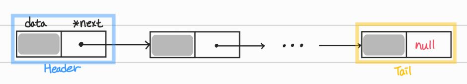
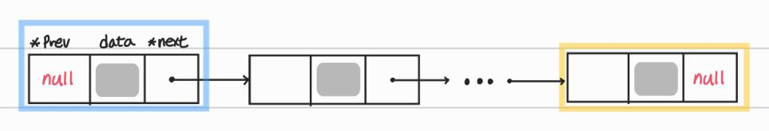
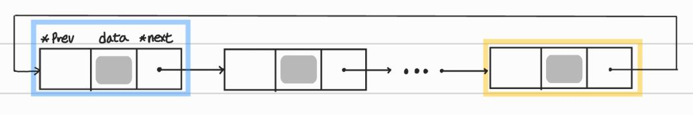

# 선형 자료 구조

- 요소가 일렬로 나열되어 있는 자료 구조

## 1. 연결 리스트 (Linked List)

- 각 노드가 데이터, 포인터를 가지고 한 줄로 연결되어 있는 방식으로 데이터를 저장하는 자료구조
- 삽입, 삭제가 O(1)이 걸리며 탐색은 O(n)이 걸림
- 맨 앞에 있는 노드는 헤드(헤더)로 보고, 맨 뒤에 있는 노드는 테일로 봄
- 싱글 연결 리스트, 이중 연결 리스트, 원형 이중 연결 리스트가 있음

### 단방향 연결 리스트 (= 싱글 연결 리스트)



- data와 next 포인터만 가짐
- 한쪽 방향으로만 연결된 리스트

### 양방향 연결 리스트 (= 이중 연결 리스트)



- data와 next 포인터, prev 포인터를 가짐
- 양쪽 방향으로 연결된 리스트

### 환형 연결 리스트 (= 원형 이중 연결 리스트)



- 양방향 연결 리스트와 같지만 마지막 노드의 next 포인터가 헤드 노드를 가리킴
- 처음과 끝이 함께 연결되어 원형처럼 연결된 리스트

## 2. 배열 (Array)

- 고정된 크기(정적 배열 기준), 같은 타입의 변수들로 이루어져 인접한 메모리 위치에 있는 데이터를 모아놓은 집합
- 중복을 허용하고 순서가 있음
- 삽입, 삭제 시 O(n)이 걸리며, 탐색 시에는 O(1)이 걸려 랜덤 접근(Random Access)가 가능함

### 랜덤 접근 vs 순차적 접근

- 랜덤 접근(= 직접 접근)은 인덱스로 특정 데이터에 바로 접근 가능한 방법
- 순차적 접근은 데이터를 저장된 순서대로 검색해야 하는 접근 방법

### 연결리스트 vs 배열

|            | 랜덤접근 가능 여부 | 결론                                                                                                    |
| :--------- | :----------------: | :------------------------------------------------------------------------------------------------------ |
| 배열       |         O          | 랜덤 접근이 가능해 탐색은 빠름<br>데이터 추가, 삭제시 모든 상자를 앞, 뒤로 옮겨야해서 느림              |
| 연결리스트 |         X          | 탐색 시 순차적으로 접근해야해서 느림<br>데이터 추가, 삭제시 포인터가 가리키는 것만 바꿔주면 되므로 빠름 |

## 3. 벡터 (Vector, 동적 배열)

- 동적으로 요소를 할당할 수 있는 동적 배열
- 컴파일 시점에 개수를 모를 시, 동적 배열을 사용해야 함
- 중복을 허용하고 랜덤 접근이 가능함
- 탐색, 맨 뒤의 요소 삭제 및 삽입 시 O(1)
- 맨 뒤나 맨 앞이 아닌 요소 삭제, 삽입 시 O(n)

## 4. 스택 (Stack)

- LIFO (Last In First Out), 가장 마지막에 들어간 데이터가 가장 먼저 나오는 것
- 재귀적인 함수, 알고리즘에 주로 쓰이며 웹 브라우저 방문 기록에 쓰임
- 삽입 및 삭제시 O(1) / 탐색시 O(n)
- JavaScript로 코드 구현 시 `Array.push(element)`와 `Array.pop()`을 이용해 쉽게 구현할 수 있음

  ```js
  let stack = [];

  // 스택에 값 삽입
  stack.push(1); // 1
  stack.push(2); // 1, 2
  stack.push(3); // 1, 2, 3

  // 스택에 있는 값 제거
  stack.pop(); // 1, 2

  console.log(stack); // 1, 2
  ```

## 5. 큐 (Queue)

- FIFO (First In First Out), 가장 먼저 들어간 데이터가 가장 먼저 나오는 것
- CPU 작업을 기다리는 프로세스나 스레드 행렬, 네트워크 접속을 기다리는 행렬, 너비 우선 탐색, 캐시 등에 사용됨
- 삽입 및 삭제시 O(1) / 탐색시 O(n)
- `Array.unshift(element)`와 `Array.pop()`을 이용해 구현할 수 있음

  ```js
  let queue = [];
  // 큐에 값 삽입
  queue.unshift(1); // 1
  queue.unshift(2); // 2, 1
  queue.unshift(3); // 3, 2, 1

  // 큐에 있는 값 삭제
  queue.pop(); // 3, 2

  console.log(queue); // 3, 2
  ```

> ✅ 스택, 큐를 사용할 땐 오버플로우와 언더플로우를 고려해야함

### 오버플로우 (Overflow)

- 특정 자료구조가 수용할 수 있는 저장 공간이 꽉찬 상태에서 삽입 연산 수행시 발생함

### 언더플로우 (Underflow)

- 특정 자료구조에 데이터가 들어있지 않은 상태에서 삭제 연산 수행시 발생함
