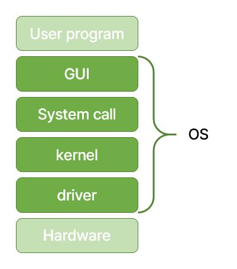
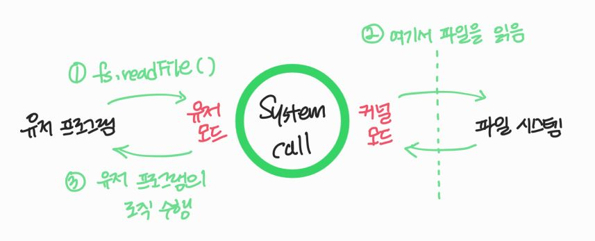
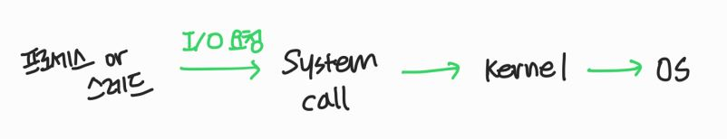
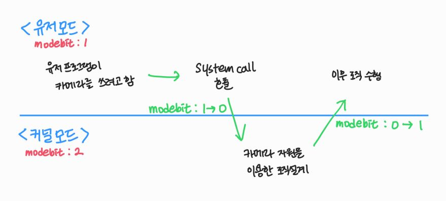

# Operating System (OS, 운영체제)

- 사용자가 컴퓨터를 쉽게 다룰 수 있도록 환경을 제공하는 인터페이스
- 한정된 메모리, 시스템 자원을 효율적으로 분배하는 시스템 소프트웨어

> ✅ 펌웨어(Firmware): OS와 유사하나 SW를 추가 설치할 수 없는 것

## OS의 역할

|     |            역할             |                                                                                        |
| :-: | :-------------------------: | :------------------------------------------------------------------------------------- |
|  1  | CPU 스케줄링, 프로세스 관리 | 어떤 프로세스에게 CPU를 할당할지 결정, 프로세스를 생성 & 삭제, 자원의 할당 & 반환 관리 |
|  2  |         메모리 관리         | 한정된 메모리를 어떤 프로세스에게 얼마나 할당할지 관리                                 |
|  3  |      파일 디스크 관리       | 디스크 파일을 어떻게 보관할지 관리                                                     |
|  4  |      입출력 장치 관리       | 마우스, 키보드와 컴퓨터 간의 데이터를 주고받는 것을 관리                               |

## OS의 구조

## 1. GUI (Graphical user interface)

- 사용자가 전자기기와 상호 작용할 수 있도록 하는 user Interface의 한 형태

## 2. CUI (Character user interface)

- 그래픽이 아닌 명령어로 처리하는 인터페이스

## 3. system call

- 운영체제가 커널에 접근하기 위한 interface
- 유저 프로그램이 운영체제의 서비스를 받기 위해 커널 함수를 호출할 때 쓴다.
- 유저 프로그램이 입출력(I/O)요청으로 트랩(trap)을 발동하면 요청이 올바른지 확인한 후, 유저 모드가 system call을 통해 kernel 모드로 변환되어 실행된다.

> ✅ I/O 요청: 입출력 함수, 데이터베이스, 네트워크, 파일 접근 등에 관한 일

- 이 과정을 통해 컴퓨터 자원에 대한 직접 접근을 차단하고, 다른 프로그램으로부터 보호할 수 있다.

> ✅ 유저모드: 사용자가 접근할 수 있는 영역이 정해져있고, 컴퓨터 자원에 함부로 접근하지 못하는 모드

> ✅ 커널모드: 모든 컴퓨터 자원에 접근할 수 있는 모드

### 3.1 system call, kernel, os

- 프로세스나 스레드에서 os로 어떤 요청을 하면 system call interface와 kernel을 거쳐 os에 전달된다.

- system call은 하나의 추상화 계층이다.
  - 이를 통해 네트워크 통신 / 데이터베이스 같은 낮은 단계의 영역 처리에 대한 부분을 크게 신경쓰지 않고도 프로그램을 구현할 수 있다.

### 3.2 modebit

- system call이 작동될 때, modebit을 통해 유저 모드와 커널 모드로 구분할 수 있다.
- 0과 1의 값을 가지는 flag 변수이다.
  - 0: 커널 모드
  - 1: 유저 모드
- 입출력 디바이스는 OS를 통해서만 작동해야한다.
  - 외부의 침입을 막기 위함이다.

## 4. kernel

- 운영체제의 핵심 부분
- system call interface를 제공
- 보안, 메모리, 프로세스, 파일 시스템, I/O 디바이스, I/O 요청 관리 등 OS의 중추와 같다.

## 5. driver

- 하드웨어를 제어하기 위한 소프트웨어
