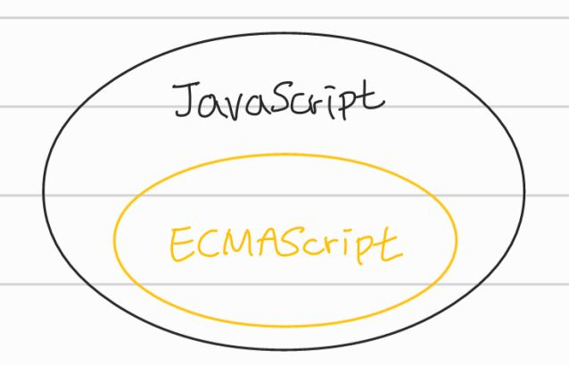

# ch01. 프로그래밍

## 프로그래밍

- 컴퓨터와의 커뮤니케이션 도구
- 구문(Syntax)과 의미(Semantics)의 조합으로 표현된다.

### 프로그래밍의 목적?

- 요구사항(문제)를 해결하기 위함이다.

### 컴파일러 or 인터프리터

- 프로그래밍 언어로 작성된 프로그램을 컴퓨터가 이해할 수 있는 기계어로 변환시켜주는 **번역기**이다.

# ch02. 자바스크립트란?

## JavaScript

- 1995년 넷스케이프의 브렌던 아이크가 개발
- '모카(Mocha)' -> '라이브스크립트(LiveScript)' -> '자바스크립트(JavaScript)'로 이름이 바뀌었다.
- 초창기에는 한정적인 용도(HTML, CSS 등)로 \*렌더링하는 수준이었다.

> ✅ 렌더링: HTML, CSS, JS로 작성된 문서를 해석해 브라우저에 시각적으로 출력되는 것

## AJAX (Asynchronous JavaScript And XML)

- 1999년 자바스크립트를 이용해 서버와 브라우저가 비동기 방식으로 데이터를 교환할 수 교환하는 AJAX가 `XMLHttpRequest`라는 이름으로 등장했다.
- 초기 웹페이지는 완전한 HTML 코드를 서버로부터 전송받아 웹페이지 전체를 렌더링하는 방식으로 동작했다.
  - 이는 서버로부터 변경이 필요없는 부분까지도 재전송 받아 처음부터 다시 렌더링해야 하기 때문에 불필요한 데이터 통신이 발생하며, 순간 깜빡이는 성능적인 이슈가 있었다.
- AJAX의 등장으로 서버로부터 필요한 데이터만 전송받아 변경이 필요한 부분만 한정적으로 렌더링하는 방식이 가능해졌다.
  - 2005년, JS와 AJAX 기반으로 동작하는 '구글 맵스'는 desktop aplication과 비교했을 때 손색없을 정도의 성능, 부드러운 화면 전환을 보여주며 JS의 가능성을 확인시켜주었다.

## JQuery

- 2006년, JQuery의 등장으로 DOM(Document Object Model)을 더욱 쉽게 제어할 수 있게 되었을 뿐만 아니라 크로스 브라우징 이슈도 어느정도 해결할 수 있었다.
- JQuery는 JS보다 배우기 쉽고 직관적이었기에 큰 인기를 얻었다.

## Google V8 자바스크립트 엔진

- 구글 맵스 사례 이후 더 빠르게 동작하는 JS 엔진의 필요성이 대두되었다.
- 2008년, google의 V8 자바스크립트 엔진이 등장했고 이는 JS가 desktop aplication과 유사한 UX(user experience)를 제공할 수 있는 웹 어플리케이션 프로그래밍 언어로 정착하게 해주었다.

## Node.js

- 2009년, 라이언 달이 발표한 Google V8 자바스크립트 엔진으로 빌드된 자바스크립트 런타임 환경
- 브라우저의 자바스크립트 엔진에서만 동작하던 자바스크립트를, 브라우저 이외의 환경에서도 동작할 수 있도록 자바스크립트 엔진을 브라우저에서 독립시킨 자바스크립트 실행환경이다.
- 주로 서버사이드 어플리케이션 개발에 사용되며 이로 인해 크로스 플랫폼을 위한 가장 중요한 언어로 주목받게 되었다.

### Node.js의 특징

- 비동기 I/O를 지원하고 단일 스레드 이벤트 루프 기반으로 동작하여 요청 처리 성능이 좋다.
- 따라서 실시간으로 데이터를 처리하기 위해 I/O가 빈번히 발생하는 SPA에 적합하나 CPU 사용률이 높은 애플리케이션에는 권장하지 않는다.

### SPA

- CBD (Component Based Development) 방법론을 기반으로 하며, 어떤 웹 사이트의 전체 페이지를 하나의 페이지에 담아 동적으로 화면을 바꿔가며 표현하는 것을 의미한다.
- 뭔가를 클릭하거나 스크롤하면, 상호작용하기 위한 최소한의 요소만 변경이 일어난다.
- 페이지 변경이 일어난다고 보여지는 것 또한 최초 로드된 자바스크립트를 통해 미리 브라우저에 올라간 템플릿만 교체되는 것이다.
- cf. [SPA란?](https://www.huskyhoochu.com/what-is-spa/)

## JavaScript와 ECMAScript

### ECMAScript

- JavaScript의 표준 사양
  - 프로그래밍 언어의 값, 타입, 객체와 프로퍼티, 표준 빌트인 객체 등의 문법을 규정한다.
- 각 브라우저 제조사는 ECMAScript 사양을 준수하여 JavaScript 엔진을 구현한다.

### JavaScript

- 프로그래밍 언어로 기본 뼈대를 이루는 ECMAScript, 브라우저가 별도 지원하는 클라이언트 사이드 Web API (DOM, BOM, Canvas, XMLHttpRequest, fetch 등)를 아우르는 개념이다.
- 웹을 구성하는 요소에는 HTML, CSS, JavaScript가 있고 JS는 웹브라우저에서 동작하는 유일한 프로그래밍 언어이다.
- 명령형, 함수형, 프로토타입 기반 객체지향 프로그래밍을 지원하는 **멀티 패러다임 프로그래밍 언어**이다.
- 자바스크립트는 클래스 기반 객체지향 언어보다 효율적이면서 강력한 **프로토타입 기반의 객체지향 언어**이다.
- 개발자가 별도의 컴파일 작업을 수행하지 않는 \*인터프리터 언어이다.
- 대부분의 모던 JavaScript 엔진(chrome v8, Safari JavaScriptCore 등)은 인터프리터와 컴파일러의 장점을 결합해 비교적 처리 속도가 느린 인터프리터의 단점을 해결했다.

### 인터프리터 언어 vs 컴파일러 언어

| 인터프리터 언어                                        | 컴파일러 언어                                                                         |
| :----------------------------------------------------- | :------------------------------------------------------------------------------------ |
| 런타임(코드가 실행되는 단계)에 문 단위로 한 줄씩 실행  | 컴파일 타임(코드가 실행되기 전 단계)에 소스코드 전체를 한번에 머신코드로 변환 후 실행 |
| 실행 파일을 생성하지 않음                              | 실행 파일을 생성함                                                                    |
| 인터프리터는 한 줄씩 바이트코드로 변환하고 즉시 실행함 | 컴파일, 실행 단계가 분리되어 있어 컴파일 단계를 거친 후 실행 파일을 실행함            |
| 코드가 실행될 때마다 위의 과정이 반복됨                | 실행에 앞서 컴파일은 단 한번 수행됨                                                   |
| 실행 속도가 느림                                       | 실행 속도가 빠름                                                                      |

- 하지만 대부분의 모던 브라우저에서 사용되는 인터프리터는 전통적인 컴파일러 언어처럼 명시적인 컴파일 단계를 거치지는 않지만, 복잡한 과정을 거치며 일부 소스코드를 컴파일하고 실행한다.
- 이로써 인터프리터 언어의 장점인 동적 기능 지원을 살리며 실행 속도가 느리다는 단점을 극복한다.

# ch03. 자바스크립트 개발 환경과 실행 방법

- 모든 브라우저는 JavaScript를 해석, 실행할 수 있는 자바스크립트 엔진을 내장하고 있다.
  - 따라서 JS는 브라우저 환경 or Node.js 환경에서 실행할 수 있다.

## 브라우저와 Node.js의 목적은 다르다

- 브라우저는 HTML, CSS, JavaScript를 실행해 웹페이지를 브라우저에 화면에 렌더링 하는 것이 주된 목적이다.
- Node.js는 브라우저 외부에서 자바스크립트 실행 환경을 제공하는 것이 주된 목적이다.

> ✅ 브라우저와 Node.js 모두 자바스크립트의 코어인 ECMAScript를 실행할 수 있지만, 이외에 추가로 제공하는 기능은 호환되지 않는다.

