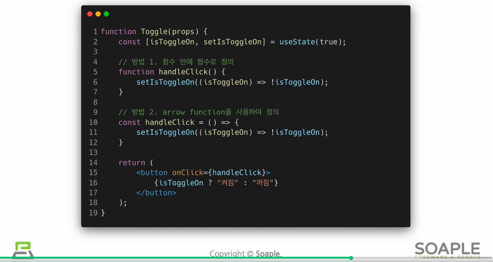

# 4. 이벤트 핸들링

- 이벤트(Event)란 사용자가 웹 브라우저에서 DOM 요소들과 상호작용하는 것

## 4. 1. 리액트의 이벤트 시스템

- 웹 브라우저의 HTML 이벤트와 인터페이스가 동일하나 주의사항이 있음
    - 이벤트 이름은 카멜케이스로 작성해야 함 (ex. onClick, onKeyUp)
    - 이벤트에 실행할 자바스크립트 코드가 아닌 함수 형태의 값을 전달해야 함
        - 함수 형태의 객체를 전달해야 함
    - DOM 요소에만 이벤트를 설정할 수 있음
        - 컴포넌트에는 자체적으로 이벤트를 설정할 수 없음
        - `<MyComponent onClick={doSomething} />`을 하게 되면 이름이 onClick인 props를 MyComponent에게 전달해주는 것뿐
        - 단, 전달받은 props를 컴포넌트 내부의 DOM 이벤트로 설정할 수는 있음

## 4. 2. 이벤트 핸들링 익히기

### 1) SyntheticEvent

```jsx
onChange={
	(e) => {
		console.log(e);
	}
}
```

- 콘솔에 기록되는 e 객체는 SyntheticEvent로, 웹 브라우저의 네이티브 이벤트를 감싸는 객체
    - 네이티브 이벤트와 인터페이스가 같으므로 순수 JS에서 HTML이벤트를 다룰 때와 똑같이 쓰면 됨
- 그러나 SyntheticEvent는 네이티브 이벤트와 달리 이벤트가 끝나고 나면 이벤트가 초기화되므로 정보를 참조할 수 없음
    - 비동기적으로 이벤트 객체를 참조할 일이 있다면 `e.persist()`를 호출해 주어야 함
    
    ```jsx
    console.log(e.target.value); 
    ```
    
    - 위와 같이 바꾸면 값이 바뀔 때마다 바뀌는 값을 바로바로 콘솔에 기록함

### 2) 임의의 메서드 만들기

- 함수를 미리 준비해 전달할 수도 있음

### 3) 객체 안에서 key를 []로 감싸면

- 객체 안에서 key를 `[]`로 감싸면 그 안에 넣은 레퍼런스가 가리키는 실제 값이 key값으로 사용됨
    
    ```jsx
    const name = 'variantKey';
    const object = {
    	[name]: 'value'
    };
    ```
    
    - 위의 코드는 결국 아래와 같음
    
    ```jsx
    {
    	'variantKey: 'value'
    }
    ```
    

### 4) onKeyPress 이벤트 핸들링

- Enter를 눌렀을 때 handleClick 메서드를 호출하게끔 해보기
    
    ```jsx
    handleKeyPress = (e) => {
    	if(e.key === 'Enter') {
    		this.handleClick();
    	}
    }
    
    return(
    	<button onClick={this.handleClick}>확인</button>
    )
    ```
    

## 4. 3. 함수형 컴포넌트로 구현해보기

- input이 많아지면 `e.target.name`을 활용하는 것이 더 좋을 수 있음

```jsx
import React, { useState } from 'react';

const EventPractice = () => {
  const [form, setForm] = useState({
    username: '',
    message: ''
  });
  const { username, message } = form;
  const onChange = e => {
    setTimeout(() => console.log(e), 500);
    const nextForm = {
      ...form, // 기존의 form 내용을 이 자리에 복사 한 뒤
      [e.target.name]: e.target.value // 원하는 값을 덮어씌우기
    };
    setForm(nextForm);
  };
  const onClick = () => {
    alert(username + ': ' + message);
    setForm({
      username: '',
      message: ''
    });
  };
  const onKeyPress = e => {
    if (e.key === 'Enter') {
      onClick();
    }
  };
  return (
    <div>
      <h1>이벤트 연습</h1>
      <input
        type="text"
        name="username"
        placeholder="유저명"
        value={username}
        onChange={onChange}
      />
      <input
        type="text"
        name="message"
        placeholder="아무거나 입력해보세요"
        value={message}
        onChange={onChange}
        onKeyPress={onKeyPress}
      />
      <button onClick={onClick}>확인</button>
    </div>
  );
};
export default EventPractice;
```

----

# Event
## Event란?
- 특정사건을 의미함
  - ex) 사용자가 버튼을 클릭한 것

### DOM과 리액트에서의 Event 비교
- 이벤트 이름의 표기법과 함수 전달 방식에 차이가 있음
- DOM event
    ```html
    <button onclick="activate()">
        Activate
    </button>
    ```
- 리액트 event
    ```jsx
    <button onClick={activate}>
        Activate
    </button>
    ```

## Event Handler
- 이벤트가 발생했을 때, 이벤트를 처리하는 역할을 함
- Event Listener 역할을 함 (이벤트를 들음)


## Event handler에 arguments 전달하는 법
### arguments
- 함수에 주장할 내용, 즉 함수에 전달할 데이터를 의미함
- event handler에 전달할 데이터
### parameter
- 매개변수