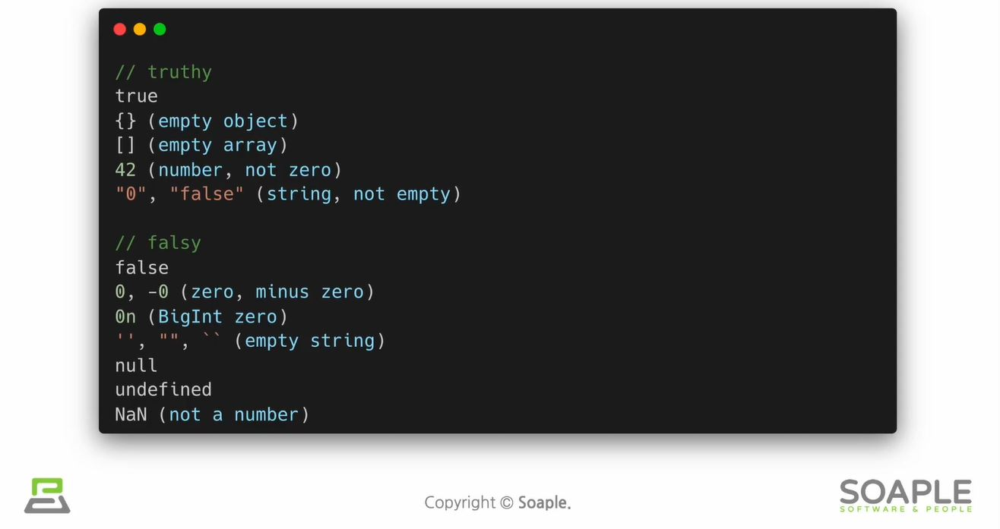

# Conditional Rendering
- 조건부 렌더링 
- 조건(조건문)에 따라 렌더링이 달라지는 것

## javascript의 truthy와 falsy값
- Truthy
  - true는 아니지만 true로 여겨지는 값
- Falsy
  - false는 아니지만 flase로 여겨지는 값

## Element Variables
- 리액트의 element(component)를 변수처럼 다루는 방법

## Inline Conditions
- 조건문을 코드 안에 집어넣는 것
### 1. Inline if
- if문을 필요한 곳에 직접 넣어 사용함
- && 연산자를 이용 (단축평가)
  - true && expression -> expression
  - false && expression -> false

### 2. Inline if-else
- ? 연산자를 사용 (삼항연산자)
- condition ? true : false

## Component 렌더링 막기
- null을 리턴하면 렌더링이 되지 않음 

> 리액트에서 특정 컴포넌트를 렌더링하고싶지 않으면 null을 리턴하면 됨