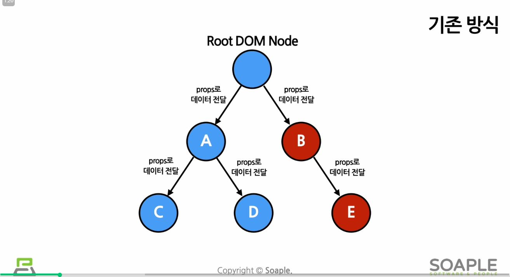
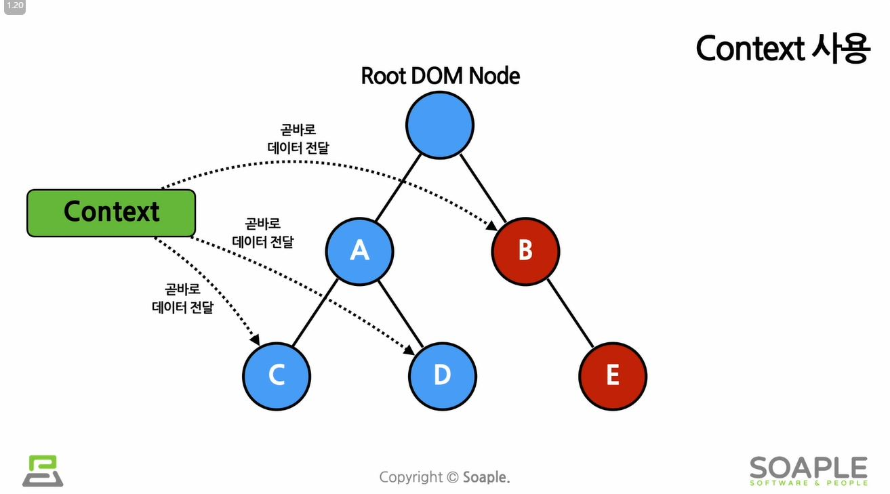

# Context
## 데이터 전달 방법 비교
### 기존 react에서의 데이터 전달방법

- 원래 리액트는 컴포넌트의 props를 통해 데이터를 전달함
- 여러 컴포넌트에 걸쳐 자주 사용되는 데이터를 전달하려면, 반복적이고 지저분한 코드가 많이 쓰일수 밖에 없음 
- 최상위 데이터가 7단계 아래의 컴포넌트로 전달되어야하는 경우, 7번이나 옮겨줘야 함

### Context를 이용한 데이터 전달방법

- Context를 사용하면 하나씩 직접 props를 전달할 필요없이 데이터를 필요로하는 컴포넌트에 곧바로 데이터를 전달할 수 있음
- 코드도 간결해지고, 데이터를 한곳에서 관리하기때문에 디버깅에도 유리함
- Context는 데이터를 매번 컴포넌트를 통해 전달할 필요 없이 컴포넌트 트리로 곧바로 전달하게 해줌
- 

## Context를 사용해야하는 경우
- 여러 개의 Component들이 접근해야하는 데이터
  - 로그인 여부, 로그인 정보, UI테마, 현재 선택한 언어 등 ...

## Context를 사용하기 전 고려할 점
- 무조건 Context를 사용하는 게 좋은 것만은 아님
- Context를 사용하면 재사용성이 떨어지기 때문

## Context를 쉽게 사용하는 방법
- useContext() Hook을 이용하면 됨
