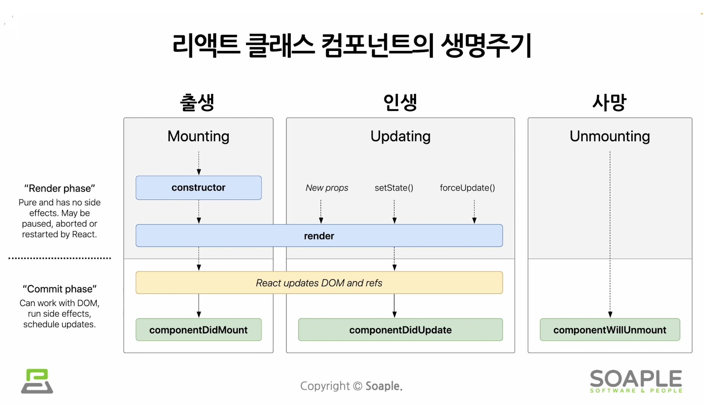

# State (상태)
- 리액트 Component의 상태
- 리액트 Component의 변경 가능한 데이터
- state는 개발자가 직접 정의해서 사용함
- **렌더링이나 데이터 흐름에 사용되는 값만** state에 포함시켜야 함
  - state가 변경될 경우 component가 재렌더링되기 때문에 렌더링과 데이터 흐름에 관련없는 값을 포함하면 불필요한 렌더링이 일어나 성능이 저하될 수 있음
  - 렌더링과 데이터 흐름에 관련없는 값은 컴포넌트의 인스턴스 필드에 정의하면 됨
- 단지 하나의 JavaScript 객체임

## class 컴포넌트에서의 기본 형태
```jsx
class LikeButton extends React.Component {
    constructor(props) {
        super(props);

        this.state ={ // 현재 컴포넌트에서 state를 정의하는 부분
            liked: false
        };
    }
    ...
}
```
- 모든 클래스 컴포넌트에는 `constructor`가 존재함
- `constructor`는 클래스가 생성될 때 실행되는 함수
- 컴포넌트에서 state를 정의하는 부분
  - 클래스 컴포넌트: 생성자에서 정의함
  - 함수 컴포넌트: `useState()`라는 Hook을 사용해서 정의함

- **state는 직접 수정할 수 없음 (수정은 가능하나 수정해서는 안됨)**


### 클래스 컴포넌트에서는 state를 수정하는 법
- 반드시 `setState()`를 이용해야 함
```jsx
// state를 직접 수정 (=> 잘못된 사용법)
this.state = {
    name: 'Muz'
};

// setState 함수를 통한 수정 (=> 올바른 사용법)
this.setState({
    name: 'Muz'
});
```

# Lifecycle (생명주기)
- 리액트 component의 생명주기
  - 컴포넌트 생성, 업데이트, 소멸 시점이 정해져있음

- 생명주기에 따라 호출되는 클래스컴포넌트의 함수인 **Lifecycle Method**들이 있음
  - `componentDidMount`, `componentDidUpdate`, `componentWillUnmount`
- 컴포넌트가 Unmount되는 시점?
  - 상위 컴포넌트에서 현재 컴포넌트를 더이상 화면에 표시하지 않게 될 때
  - Unmount 직전에 `componentWillUnmount`함수가 호출됨


> ✅ 컴포넌트는 계속 존재하는 것이 아닌, 시간의 흐름에 따라 생성되고 업데이트 되다가 사라짐

# 실습
- 생성자에서는 앞으로 사용할 데이터를 넣어서 초기화 해줌
    ```jsx
    this.state = {
        notifications: [],
    },
    ```

- 후에 state를 업데이트하기 위해서는 `setState`를 이용함
    ```jsx
    this.setState({
        notificatoins: notifications,
    });
    ```

## Lifecycle method 사용해보기
### `componentDidMount()`
- 컴포넌트가 마운트 된 이후에 실행됨
### `componentDidUpdate()`
- 컴포넌트가 업데이트된 이후에 실행됨
### `componentWillUnmount()`
- 컴포넌트가 언마운트되기 전에 실행됨