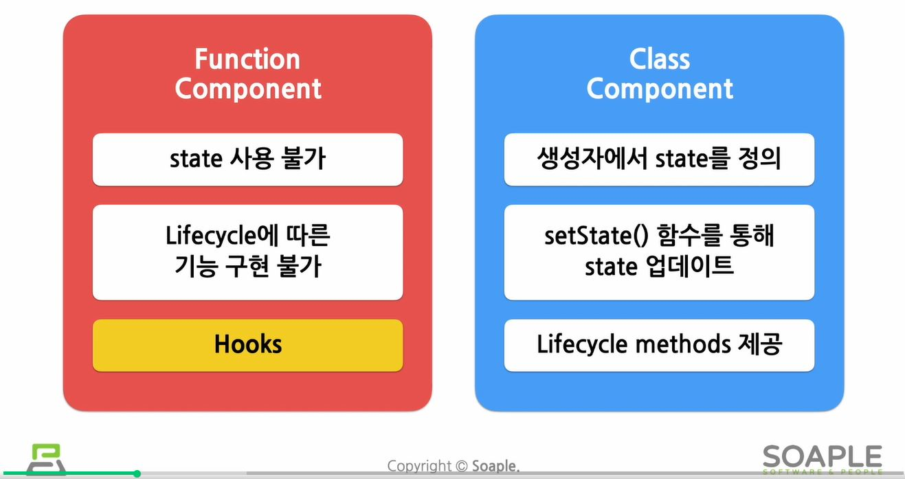

# Hooks
- v16.8에서 새로 등장한 개념
- 리액트는 State를 통해 렌더링에 필요한 데이터를 관리함

- hook은 '갈고리'라는 뜻으로, 프로그래밍에서는 존재하는 기능에 마치 갈고리를 거는 것처럼해서 함께 수행됨
- 리액트의 state, 생명주기에 갈고리를 걸어 원하는 시점에 정해진 함수를 실행되도록 만든 것으로, 이때 실행되는 함수를 `Hooks`라고 부름
- Hook의 이름은 모두 `use~`로 시작함
  - 개발자가 직접 만들어 사용하는 `custom Hook`도 있음

# Hooks의 종류
## 1. useState()
- state를 사용하기 위한 Hook
```jsx
const [변수명, set함수명] = useState(초깃값);
```
- 초깃값: 파라미터로 호출할 state의 초깃값
- 이를 이용해야만 렌더링 때 값이 변함
- return값으로 배열이 나옴
  -  첫번째 항목은 state로 선언된 변수
  -  두번째 항목은 해당 state의 set함수
- 다만 클래스 컴포넌트에서는 setState()함수 하나로 모든 state값을 업데이트 할 수 있었으나, useState를 사용하는 방법에서는 **변수 각각에 대해 set함수가 따로 존재**함

## 2. useEffect()
- side effect를 수행하기 위한, 실행할 수 있게 해주는 Hook
```jsx
useEffect(이펙트 함수, 의존성 배열);
```
- 의존성 배열: 이펙트가 의존하고 있는 배열
  - 배열 안에 있는 값이 하나라도 변경되었을 때 이펙트 함수가 실행됨
- 이펙트 함수는 처음 컴포넌트가 렌더링된 이후와 업데이트로 인한 재 렌더링 된이후에 실행됨


if. Effect function이 mount, unmount 시에 단 한 번씩만 실행되게 하려면
- 의존성 배열에 빈 배열을 넣으면 됨
- 이렇게하면 해당 이펙트가 props나 state에 있는 어떤 값에도 의존하지 않게되므로 여러번 실행되지 않음
```jsx
userEffect(이펙트 함수, [])
```

### side effect (부작용)
- 개발자가 의도치않은 코드가 실행되면서 버그가 나타나면 side effect가 발생했다고 말함
- 리액트에서 side effect은 **효과, 영향**을 의미함
  - 서버에서 데이터를 받아오거나 
  - 수동으로 DOM을 변경하는 작업을 의미함
- 위의 작업들을 side effect라 부르는 이유?
  - 다른 컴포넌트에 영향을 미칠 수 있으며, 렌더링 중에는 작업이 완료될 수 없기 때문 (=> 렌더링이 끝난 이후에 실행되는 작업들)

### 클래스 컴포넌트에서의 useEffect?
- useEffect는 클래스 컴포넌트에서 제공하는 생명주기함수들과 동일한 기능을 하나로 통합해서 제공함

### `componentDidMount`, `componentDidUpdate` 구현하기?
- 의존성 배열은 생략 가능함
  - 단, 생략 시 컴포넌트가 업데이트될 때마다 호출 됨
  - 다시말해 리액트는 DOM이 변경된 이후에 해당 effect 함수를 실행하라는 의미로 받아들임
  - 그래서 기본적으로 컴포넌트가 처음 렌더링될 때를 포함해서 매번 렌더링될 때마다 effect가 실행된다고 보면 됨
  - 즉, `componentDidMount`, `componentDidUpdate`와 동일한 역할을 하는 것

### `componentWillUnmount` 구현하기?
- useEffect 내에서 return 부분을 구현하는 것이 `componentWillUnmount`를 구현하는 것과 같음


### userEffect는 하나의 컴포넌트에 여러 개를 쓸 수 있음

### useEffect 총정리
```jsx
useEffect(() => {
    // 컴포넌트가 마운트 된 이후,
    // 의존성 배열에 있는 변수들 중 하나라도 값이 변경되었을 때 실행됨
    // 의존성 배열에 빈 배열([])을 넣으면, 마운트와 언마운트 시 단 한번씩만 실행됨
    // 의존성 배열 생략 시, 컴포넌트 업데이트시마다 실행됨
    ...

    return () => {
        // 컴포넌트가 마운트 해제되기 전에 실행됨
        ...
    }
}, [의존성 변수1, 의존성 변수2, ...]);
```

## 3. useMemo
- Memoized value를 리턴하는 hook
```js
const memoizedValue = useMemo(
    () => {
        // 연산량이 높은 작업을 수행해 결과를 반환
        return computeExpensiveValue(의존성 변수1, 의존성 변수2);
    },
    [의존성 변수1, 의존성 변수2]
);
```
- memoizedvalue를 생성하는 create 함수와 의존성 배열을 파라미터로 받음
- 의존성 배열에 든 변수가 변했을 경우에만 새로 create함수를 호출하여 결과값을 반환하며 그렇지 않은 경우에는 기존함수의 결과값을 그대로 반환함
- useMemo Hook 사용시 컴포넌트가 다시 렌더링될 때마다 연산량이 높은 작업을 반복하는 것을 피할 수 있음
  - 즉, 빠른 렌더링이 가능해짐
  
> ✅ useMemo로 전달된 함수는 렌더링이 일어나는 동안에 실행됨
> - 그러니 렌더링이 일어나는 동안 실행되서는 안될 작업을 useMemo에 넣어서는 안됨
> - ex) side effect 같은 것들 (서버에서 데이터를 받아오거나.. )

### Memoization
- 최적화를 위해 사용하는 것
- 연산량이 많은 함수의 호출 결과를 저장해두었다가 같은 입력값으로 함수 호출 시 새로 연산하지 않고, 이전에 저장해둔 값을 반환하는 방법
- 불필요한 중복연산도 하지않고, 시간도 줄일 수 있어 컴퓨터 자원을 적게 쓸 수 있음
- memoization된 결과 값을 영어로 `Memoized value`라고 부름
- memo, 즉 메모해두었다가 나중에 다시 사용하는 것

### 의존성 배열을 넣지 않을 경우, 매 렌더링마다 create 함수가 실행됨
- 이 경우 아무런 의미가 없게됨
```jsx
const memoizedValue = useMemo(
    () => computeExpensiveValue(a, b)
);
```

### 의존성 배열이 빈 배열일 경우
- 컴포넌트 마운트 시에만 create함수가 호출됨
  - **결국 마운트 이후에는 값이 변경되지 않는다는 것**
```jsx
const memoizedValue = useMemo(
    () => {
        return computeExpensiveValue(a, b);
    },
    []
);
```
> ✅ 대부분의 경우 useMemo Hook에 의존성 배열의 변수들을 넣고 해당 변수들의 값이 바뀜에 따라 새로 값을 계산해야 할 경우에 사용함

## 4. useCallback
- useMemo() Hook과 유사하지만, 값이 아닌 **함수를 반환**함
- 컴포넌트가 렌더링될 때마다 매번 함수를 새로 정의하는 게 아닌, 의존성 배열의 값이 바뀐 경우에만 함수를 새로 정의해서 리턴해줌
  
```jsx
const memoizedCallback = useCallback(
    () => {
        doSomething(의존성 변수1, 의존성 변수2);
    },
    [의존성 변수1, 의존성 변수2]
);
```
- 파라미터로 받는 함수를 `callback`이라 부름
- 의존성 배열에 있는 변수 중 하나라도 변경되면 Memoization된 콜백함수를 반환함

### useMemo와 useCallback의 공통점
- 의존성 배열에 따라 memoized값을 반환한다는 점에서 이 둘은 완전히 동일함
```jsx
// 아래의 두 코드는 완전히 동일한 역할을 함
useCallback(함수, 의존성 배열);
useMemo(() => 함수, 의존성 배열);
```
- 만약 useCallback 훅을 사용하지않고 컴포넌트 내에 함수를 정의한다면, 매번 렌더링이 일어날때마다 함수가 새로 정의됨
- 따라서 useCallback 훅을 사용하여 특정 변수의 값이 변한 경우에만 함수를 다시 정의하도록해서, 불필요한 반복 작업을 없애주어야 함

## 5. useRef
- Reference를 사용하기 위한 Hook
- reference 객체를 반환함

```jsx
const refContainer = useRef(초깃값);
```
- 파라미터로 초깃값을 넣으면 해당 초깃값으로 초기화된 레퍼런스 객체를 반환함
- if. 초깃값이 null이라면 current의 값이 null인 reference 객체가 반환됨
- 반환된 reference 객체는 컴포넌트의 라이프타임 전체에 걸쳐 유지됨
  - 즉, 컴포넌트의 마운트 해제 전까지는 계속 유지된다는 것

> ✅ `useRef`는 변경가능한 current란 속성을 가진 하나의 상자와 같음

### Reference?
- 특정 컴포넌트에 접근할 수 있는 객체
- `refObject.current`는 현재 reference, 즉 현재 참고하고 있는 element를 의미함

> ✅ useRef() Hook은 내부의 데이터가 변경되었을 때 별도로 알리지 않음
> - current 속성을 변경한다고 해서 재 렌더링이 일어나지는 않음

### Callback ref
- ref에 DOM 노드가 연결되거나 분리되었을 경우에 어떤 코드를 실행하고 싶을 때 사용하는 것
- DOM 노드의 변화를 알기위한 가장 기초적인 방법
- react는 ref가 다른 노드에 연결될 때마다 callback을 호출함
- `useRef`는 데이터 변경 여부를 알려주지 않기때문에 `useCallback` Hook을 사용하는 callback ref 방식을 사용해야 자식 컴포넌트가 변경되었을 때 알림을 받을 수 있고, 이를 통해 다른 정보들을 업데이트 할 수 있음 