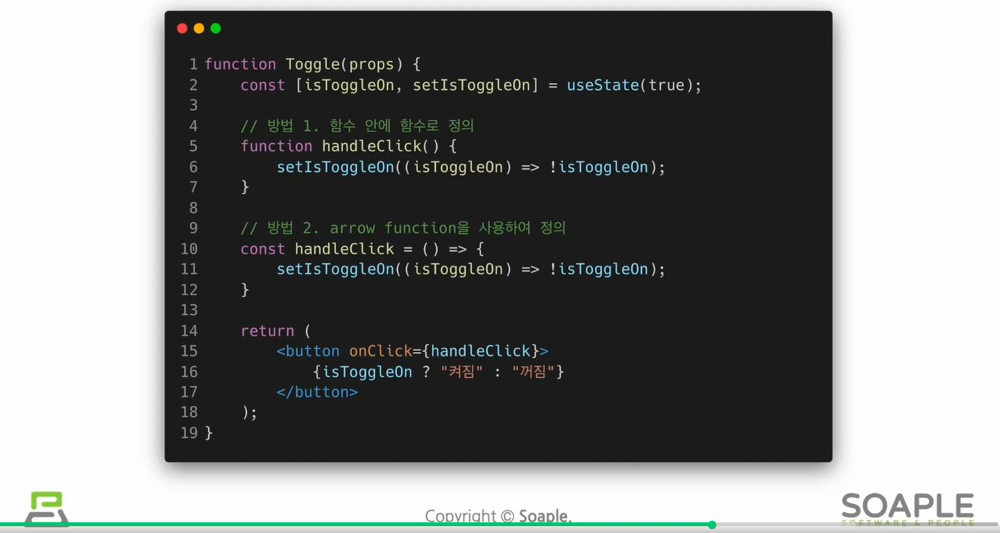

# Event
## Event란?
- 특정사건을 의미함
  - ex) 사용자가 버튼을 클릭한 것

### DOM과 리액트에서의 Event 비교
- 이벤트 이름의 표기법과 함수 전달 방식에 차이가 있음
- DOM event
    ```html
    <button onclick="activate()">
        Activate
    </button>
    ```
- 리액트 event
    ```jsx
    <button onClick={activate}>
        Activate
    </button>
    ```

## Event Handler
- 이벤트가 발생했을 때, 이벤트를 처리하는 역할을 함
- Event Listener 역할을 함 (이벤트를 들음)


## Event handler에 arguments 전달하는 법
### arguments
- 함수에 주장할 내용, 즉 함수에 전달할 데이터를 의미함
- event handler에 전달할 데이터
### parameter
- 매개변수