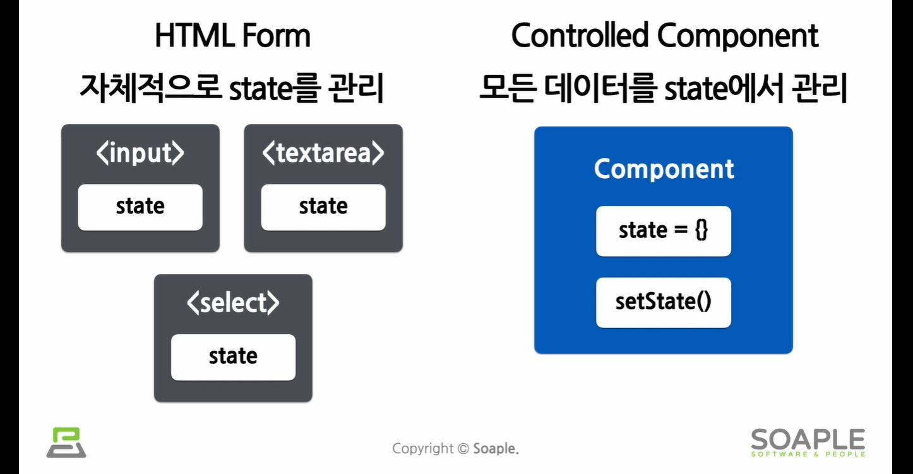

# Form
- form은 사용자로부터 입력을 받기 위해 사용하는 것

## react의 form vs HTML의 form
- react는 컴포넌트 내부에서 state를 통해 데이터를 관리함
- HTML form은 element 내부에 각각의 state가 존재함

### HTML form
```html
<form>
    <label>
        이름:
        <input type="text" name="name" />
    </label>
    <button type="submit">제출</button>
</form>
```
- 가장 기본적인 형태지만 이는 react에서 javascript 코드로 사용자의 입력값에 접근하고 조작하기 다소 불편함

# Controlled Components
- 사용자가 입력한 값에 접근하고 제어할 수 있도록 해주는 컴포넌트
- 값이 리액트의 통제를 받는 input form element


```jsx
function NameForm(props) {
    const [value, setValue] = useState('');

    const handleChange = (event) => { // 이벤트 객체
        setValue(event.target.value); // 해당 타켓의 value값, 즉 input 값
    }

    const handleSubmit = (event) => {
        alert('입력한 이름: ' + value);
        event.preventDefault();
    }

    return (
        <form onSubmit={handleSubmit}>
            <label>
                이름:
                <input> type="text" value={value} onChange={handleChange} />
            </label>
        </form>
    )
}
```

- comtrolled Components를 사용하게 되면 입력값이 react의 state를 통해 관리됨
- 즉, 여러개의 입력 양식의 값을 원하는 대로 조정할 수 있다는 말.

# 다양한 form
## 1. Textarea 태그
- 여러 줄에 걸쳐 긴 텍스트를 입력받기 위한 HTML 태그

### html 코드
```html
<textarea>
    텍스트가 들어옵니다.
</textarea>
```

### react 코드
```jsx
function RequestForm(props) {
    const [value, SetValue] = useState('요청사항을 입력하세요. ');

    const handleChange = (event) => {
        setValue(event.target.value);
    }

    const handleSubmit = (event) => {
        alert('입력한 요청사항: ' + value);
        event.preventDefault();
    }

    return (
        <form onSubmit={handleSubmit}>
            <label>
                요청사항:
                <textarea value={value} onChange={handleChange} />
            </label>
            <button type="submit">제출</button>
        </form>
    )
}
```

## 2. Select 태그
- Drop-down 목록(여러 옵션 중에서 하나를 선택)을 보여주기 위한 HTML 태그 

### html 코드
- 현재 선택된 옵션은 'selected'라는 attribute를 가지고 있음
```html
<select>
    <option value="apple">사과</option>
    <option value="banana">바나나</option>
    <option selected value="grape">포도</option> 
    <option value="watermelon">수박</option>
</select>
```

### react
```jsx
function FruitSelect(props) {
    const [value, SetValue] = useState('grape');

    const handleChange = (event) => {
        setValue(event.target.value);
    }

    const handleSubmit = (event) => {
        alert('선택한 과일: ' + value);
        event.preventDefault();
    }

    return (
        <form onSubmit={handleSubmit}>
            <label>
                과일을 선택하세요:
                <select value={value} onChange={handleChange}>
                    <option value="apple">사과</option>
                    <option value="banana">바나나</option>
                    <option value="grape">포도</option>
                    <option value="watermelon">수박</option>
                </ select>
            </label>
            <button type="submit">제출</button>
        </form>
    )
}
```
- grape라는 초기값을 가진 value가 있음
- 이 value를 `<select>`태그에 value로 넣어주고 있으며, 값이 변경된 경우 `handleChange`에서 `setValue`를 사용해 값을 변경하고 있음 
- 사용자가 옵션을 선택했을 때 `value`라는 하나의 값만 업데이트하면 됨
- if. 목록에서 다중으로 선택되게끔 하려면
    ```jsx
    <select multiple={true} value={['B', 'C']}>
    ```
    - `multiple`이라는 속성값을 true로 하고, `value`에 선택된 옵션값을 배열로 넣어주면 됨

## 3. input, textarea, select 태그 정리
- input 태그, textarea 태그, select 태그를 Controlled Component로 만드는 방법은 모두 `value`를 통해 값을 전달하고, 값을 변경할 때에는 `onChange`에서 `setValue`를 사용해 값을 업데이트 함

## 4. File input 태그
- 디바이스의 저장 장치로부터 하나 or 여러 개의 파일을 선택할 수 있게 해주는 HTML 태그
- 서버로 파일을 업로드하거나, JavaScript의 파일 API를 사용해서 파일을 다룰 때 사용함

```jsx
<input type="file" />
```
- file input 태그는 값이 읽기 전용이므로 `Uncontrolled Component`가 됨
- 즉, 값이 리액트의 통제를 받지 않음 

# Multiple Inputs
- 하나의 컴포넌트에서 여러 개의 input을 다루어야할 경우 
- 여러 개의 state를 선언해 각각의 입력에 대해 사용하면 됨

# Input Null Value
- value props는 넣되, 자유롭게 입력하고 싶다면 값에 undefined나 null을 넣으면 됨