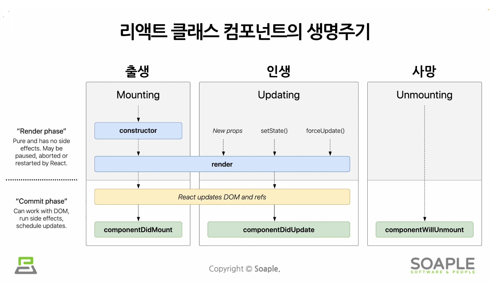
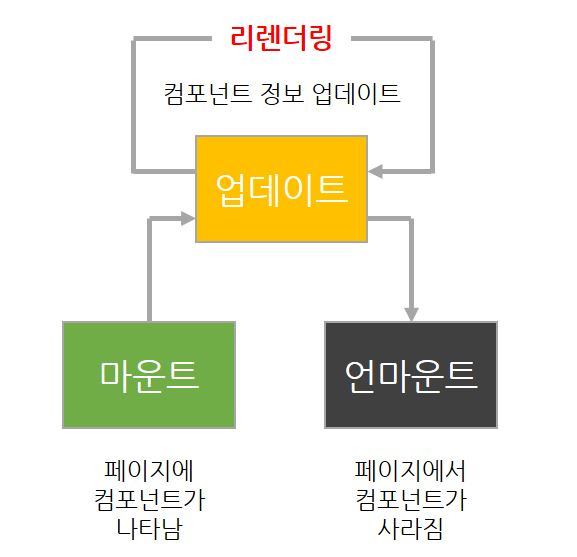

# 1. State (상태)
- 리액트 Component의 상태
- 리액트 Component의 변경 가능한 데이터
- state는 개발자가 직접 정의해서 사용함
- **렌더링이나 데이터 흐름에 사용되는 값만** state에 포함시켜야 함
  - state가 변경될 경우 component가 재렌더링되기 때문에 렌더링과 데이터 흐름에 관련없는 값을 포함하면 불필요한 렌더링이 일어나 성능이 저하될 수 있음
  - 렌더링과 데이터 흐름에 관련없는 값은 컴포넌트의 인스턴스 필드에 정의하면 됨
- 단지 하나의 JavaScript 객체임

## class 컴포넌트에서의 기본 형태
```jsx
class LikeButton extends React.Component {
    constructor(props) {
        super(props);

        this.state ={ // 현재 컴포넌트에서 state를 정의하는 부분
            liked: false
        };
    }
    ...
}
```
- 모든 클래스 컴포넌트에는 `constructor`가 존재함
- `constructor`는 클래스가 생성될 때 실행되는 함수
- 컴포넌트에서 state를 정의하는 부분
  - 클래스 컴포넌트: 생성자에서 정의함
  - 함수 컴포넌트: `useState()`라는 Hook을 사용해서 정의함

- **state는 직접 수정할 수 없음 (수정은 가능하나 수정해서는 안됨)**


### 클래스 컴포넌트에서는 state를 수정하는 법
- 반드시 `setState()`를 이용해야 함
```jsx
// state를 직접 수정 (=> 잘못된 사용법)
this.state = {
    name: 'Muz'
};

// setState 함수를 통한 수정 (=> 올바른 사용법)
this.setState({
    name: 'Muz'
});
```

# 2. Lifecycle (생명주기)
- 리액트 컴포넌트에는 라이프사이클(생명 주기)이 존재한다.
- 컴포넌트의 수명은 페이지에 렌더링되기 전 ~ 페이지에서 사라질 때 끝난다.
- 특정 순간에 특정 작업을 해야할 때, 컴포넌트의 라이프사이클 메서드를 사용한다.
  - 단, 라이프사이클 메서드는 클래스형 컴포넌트에서만 사용할 수 있으며
  - 함수형 컴포넌트에서는 Hooks가 이를 대신한다. 

# 3. Lifecycle Method



- 컴포넌트는 계속 존재하는 것이 아니다. 
- 생명주기에 따라 호출 및 소멸된다.

## 3.1 Lifecycle method의 종류 (1) - 마운트, 업데이트, 언마운트
- 보통 3가지의 카테고리로 나누어진다.



### 3.1.1 마운트 (Mount)
- DOM이 생성되고 웹 브라우저상에 나타나는 것을 말한다.
- 마운트 시 호출하는 메서드
    |단계|함수|의미|
    |:-:|:-|:--|
    |1|컴포넌트 만들기||
    |2|constructor|컴포넌트를 새로 만들 때마다 호출되는 클래스 생성자 메서드|
    |3|getDerivedStateFromProps|props에 있는 값을 state에 넣을 때 사용하는 메서드|
    |4|render|준비한 UI를 렌더링하는 메서드|
    |5|componentDidMount|컴포넌트가 웹 브라우저상에 나타난 후 호출하는 메서드|

### 3.2.2 업데이트 (Update) ★★★
컴포넌트 업데이트를 발생시키는 요인은 크게 4가지가 있다.
1. props가 변경될 때
2. state가 (setState를 통해) 변경될 때
3. 부모 컴포넌트가 리렌더링될 때
4. this.forceUpdate로 강제로 렌더링을 트리거할 때

- 업데이트할 때 호출하는 메서드
    |단계|함수|의미|
    |:-:|:-|:--|
    |1|업데이트가 발생함||
    |2|getDerivedStateFromProps|업데이트 시작 전에도, 마운트 과정에서도 호출됨. <br>props의 변화에 따라 state 값에도 변화를 주고 싶을 때 사용|
    |3|shouldComponentUpdate|컴포넌트가 리렌더링 할지말지 결정하는 메서드. <br> true 반환 시 render 호출. false반환 시 해당 지점에서 작업 취소|
    |4|render|컴포넌트를 리렌더링함|
    |5|getSnapshotBeforeUpdate|컴포넌트 변화를 DOM에 반영하기 바로 직전에 호출하는 메서드|
    |6||웹 브라우저상의 실제 DOM 변화|
    |7|componentDidUpdate|컴포넌트의 업데이트 작업이 끝난 후 호출하는 메서드|

### 3.3.3 언마운트 (Unmount)
- DOM에서 컴포넌트를 제거하는 것을 말한다.
- 언마운트 시 호출하는 메서드
    |단계|함수|의미|
    |:-:|:-|:--|
    |1||언마운트하기|
    |2|componentWillUnmount|컴포넌트가 웹 브라우저상에서 사라지기 전에 호출하는 메서드

## 3.2 Lifecycle method의 종류 (2) - 9가지로 나누어 보기
9가지의 종류로 나누어볼 때, 접두사에 따라 실행하는 때가 다르다.
- **Will~**: 어떤 작업을 작동하기 **전**에 실행되는 메서드
- **Did~**: 어떤 작업을 작동한 **후**에 실행되는 메서드

### 3.2.1 render() 함수
- render 함수는 필수 메서드로 컴포넌트의 모양새를 정의한다.
  - 리액트 요소나 컴포넌트를 반환한다.
- render() 안에서는 이벤트 설정이 아닌 곳에서 setState()를 사용해서는 안되며, 브라우저의 DOM에 접근해서도 안된다. 

### 3.2.2 constructor 메서드
- 컴포넌트의 생성자 메서드로, 컴포넌트를 만들 때 처음으로 실행된다.
- 해당 메서드에서 초기 state를 정할 수 있다.

### 3.2.3 getDerivedStateFromProps 메서드
- 리액트 v16.3 이후에 새로 나온 메서드이다.
- props로 받아 온 값을 state에 동기화시키는 용도로 쓴다.
- 컴포넌트가 마운트될 때 & 업데이트될 때 호출된다.
```js
static getDerivedStateFromProps(nextProps, prevState) {
    if(nextProps.value !== prevState.value) { // 조건에 따라 특정 값 동기화
        return { value: nextProps.value };
    }
    return null; // state를 변경할 필요가 없다면 null을 반환
}
```

### 3.2.4 componentDidMount 메서드
- 컴포넌트를 만들고, 첫 렌더링을 다 마친 후 실행합니다.

