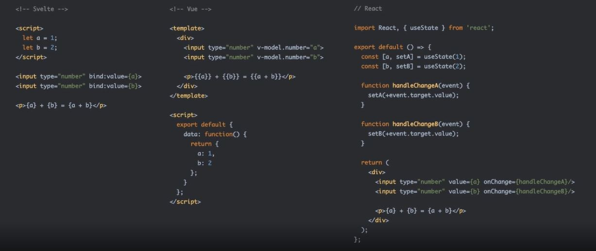

# Svelte란?
- 2016년 처음 출시된, Rich Harris가 만든 FrontEnd Framework
- 2019년 3버전에서 크게 변화하면서 큰 주목을 받기 시작했다.

# Svelte의 특징
## 1. Write Less Code; 더 적은 코드를 작성 가능하다

1. 높은 가독성 유지
2. 개발 시간 단축
3. 쉬운 리팩토링
4. 쉬운 디버깅
5. 더 적은 용량의 번들 (SPA 최적화) ★
6. 낮은 러닝 커브

## 2. No Virtual DOM; 가상DOM이 없어요
1. No Diffing 
    - Diffing: 기존에 만든 가상DOM과 새로 **생성**된 가상DOM을 **비교**해 차이를 찾아내어 **갱신**하는 것을 의미한다.
2. No Overhead
   - Overhead: 어떤 처리를 위해 쓰이는 간접적인 시간이나 메모리
   - Svelte는 가상 DOM이 없어 생성, 비교 작업 없이 바로 갱신이 이루어지므로 오버헤드가 발생하지 않는다.
3. 빠른 성능 (퍼포먼스)

## 3. Truly Reactive; 가상DOM을 사용하지 않는 진짜 반응성이다
- 반응성: 애플리케이션 상태의 변화가 DOM에 자동으로 반영되는 현상

1. Framework-less VanillaJS
   - 런타임에서 Framework를 사용하지 않고, 순수 JS가 브라우저에서 동작한다. ★
2. Only use 'devDependencies'
   - Svelte는 애플리케이션을 VanillaJS로 변환(컴파일)하고 그 결과만 동작하기 때문에, 브라우저(런타임)에서 동작하지 않는 컴파일러라고 볼 수 있다.
   - 개발 의존성 모듈로만 외부 모듈을 설치해 관리해도 된다.
3. 명시적 설계(창의적 작업)

## + 단점
1. 작은 생태계
2. CDN 미제공 (런타임에서 동작하지 않기 때문)

# REPL 사용해보기
- REPL (Read-Eval-Print-Loop)
  - 사용자에게 데이터를 입력받고
  - 이를 평가(실행)하고
  - 결과를 반환하는
  - 상호작용 컴퓨터 프로그래밍 환경

## Svelte 사용 시 규칙
1. 파일명은 항상 대문자로 시작해야한다. (ex. App.svelte)
   - 컴포넌트이면서 파일이기 때문
2. App.svelte가 프로젝트의 메인 파일이라고 생각하면 된다.
   - 때문에 이름 수정, 삭제 X